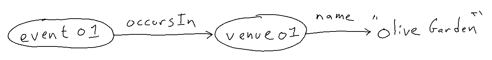

# Fused Edges

If you are doing domain modeling and using a graph database you might be tempted to used fused edges.
You see them around the semantic web.
But you should resist the temptation.

## What

In a graph database a fused edge occurs when a domain modeler uses a single edge when a node and two edges would be more thoughtful.
A fused edge is a single edge as a shortcut for multiple edges.
To me a fused edges feels like running an interstate through an area of interest and not putting an exit nearby.
They also feel like putting a cast on a joint that normally articulates.

Here is an example of a fused edge: 


And here is what that fused edge looks like in turtle (a popular RDF graph serialization):
```ttl
:event01 :venueName "Olive Garden" .
```

You can see the fusion of edges in the name of the edge usually: there is a "venue" and there is a "name."

Here is a more thoughtful representation



with an additional point of articulation: the venue.
```ttl
:event01 :occursIn :venue01 .
:venue01 :name "Olive Garden" .
```

Here is another common fused edge:  

```ttl
:person02 :mothersMaidenName "Smith" .
```

vs.

```ttl
:person02 :hasMother :person01 .
:person01 :maidenName "Smith" .
```


## Why
I can think of three (two I heard other people say) reasons why fused edges might be used.
Let's use the event and venue example.

1) [Your source data may not have details about the venue other than its name.](https://twitter.com/valexiev1/status/1509176909741109258?s=20&t=SBnKJ9_TXmVwgRgvfz2aLg)

2) ["you get better #findability with dedicated properties"](https://twitter.com/salgo60/status/1516753692728471559?s=20&t=sYoBxBlyLxBg0XWUqQ9fNQ)

3) Fewer nodes in a graph likely means fewer hardware resources are required.

Let me attempt to persuade you that you should mostly ignore those reasons to use fused edges.

(1) 

One of the ideas of the semantic web is AAA: Anyone can say Anything about Any topic.

It is hard for someone to say something about the venue (perhaps its address, current owner, hours of operation) if no node exists in the graph for it.
With the fused edge, if someone does come along later and they want to express the venue's address it is not a straight forward update.
You'd have to make a new venue node, find the event node in the graph, find all the edges expressing facts about the venue and move them to the new venue node, then connect the event to the new venue node.
Finding all the edges hanging off of the event that express facts about the venue will likely be a manual effort -- there probably won't be clever data for the machine to use that says `:venueName` is not a direct attribute of the event but rather it is a direct attribute of the venue not yet represented in the graph.

Also, fused edges encourage the use of additional fused edges.
If you don't have a node to reference then a modeler might make more fused edges in order to express additional information.

(2) 

Giving a shortcut a name can be valuable, yes.

But I think if you use a shortcut the details that the shortcut hides should also be available.
If you use fused edges those details are not available; there is only the shortcut.

There are ways to have dedicated properties without sacrificing the details.

In SPARQL you can use shortcuts: property paths.
In OWL you can define those shortcuts: property chains.

In a SPARQL query you could just do
```sparql
?event :occursIn/:name ?venue_name .
```

Or you could define that in OWL
```ttl
:venueName  owl:propertyChainAxiom  ( :occursIn  :name ) .
```
And if you have an OWL 2 reasoner active you can just query using the shortcut
```sparql
?event :venueName ?venue_name .
```

(3)

Ok, using fused edges does reduce the number of triples in your graph.
I can put a billion triples in a triplestore on my laptop and query durations will probably be acceptable.
If I put 100 billion triples on my laptop query durations might not be acceptable.
Still I think I would rather consider partitioning the data and using SPARQL query federation rather than fusing edges together to reduce resource requirements. 
I say that because I reach for semantic web technologies when I think radical data interopability and serendipity would be valuable.

Fused edges and radical data interoperability don't go together.
Fused edges are about the use cases you currently know about and the data you currently have.
Graphs with thoughtful points of articulation are about the use cases you know about, those you discover tomorrow, and about potential data.
Points of articulation in a graph suggest enrichment opportunities and new questions.


## Schema.org

[Schema.org](https://github.com/schemaorg/schemaorg) is a well known ontology that unfortunately has lots of fused edges.

If you run this SPARQL query against `schema.ttl` you'll see some examples.
```sparql
PREFIX  schema: <https://schema.org/>
PREFIX  rdfs: <http://www.w3.org/2000/01/rdf-schema#>
SELECT ?s ?com
WHERE
  { graph ?g {
      ?s rdfs:comment ?com .
      {
          GRAPH ?g
          { ?s  schema:rangeIncludes  schema:URL
            MINUS
              { ?s  schema:rangeIncludes  ?o
                FILTER ( ?o != schema:URL )
              }
          }
      }
  }
}
```

That query finds properties that are intended to have only instances of schema:URL in the object position.

You get these bindings:


|s                   |com                                                                                                                                        |
|--------------------|-------------------------------------------------------------------------------------------------------------------------------------------|
|https://schema\.org/sameAs|URL of a reference Web page that unambiguously indicates the item's identity\. E\.g\. the URL of the item's Wikipedia page, Wikidata entry, or official website\.|
|https://schema\.org/additionalType|An additional type for the item, typically used for adding more specific types from external vocabularies in microdata syntax\. This is a relationship between something and a class that the thing is in\. In RDFa syntax, it is better to use the native RDFa syntax \- the 'typeof' attribute \- for multiple types\. Schema\.org tools may have only weaker understanding of extra types, in particular those defined externally\.|
|https://schema\.org/codeRepository|Link to the repository where the un\-compiled, human readable code and related code is located \(SVN, github, CodePlex\)\.                 |
|https://schema\.org/contentUrl|Actual bytes of the media object, for example the image file or video file\.                                                               |
|https://schema\.org/discussionUrl|A link to the page containing the comments of the CreativeWork\.                                                                           |
|https://schema\.org/downloadUrl|If the file can be downloaded, URL to download the binary\.                                                                                |
|https://schema\.org/embedUrl|A URL pointing to a player for a specific video\. In general, this is the information in the \`\`\`src\`\`\` element of an \`\`\`embed\`\`\` tag and should not be the same as the content of the \`\`\`loc\`\`\` tag\.|
|https://schema\.org/installUrl|URL at which the app may be installed, if different from the URL of the item\.                                                             |
|https://schema\.org/map|A URL to a map of the place\.                                                                                                              |
|https://schema\.org/maps|A URL to a map of the place\.                                                                                                              |
|https://schema\.org/paymentUrl|The URL for sending a payment\.                                                                                                            |
|https://schema\.org/relatedLink|A link related to this web page, for example to other related web pages\.                                                                  |
|https://schema\.org/replyToUrl|The URL at which a reply may be posted to the specified UserComment\.                                                                      |
|https://schema\.org/serviceUrl|The website to access the service\.                                                                                                        |
|https://schema\.org/significantLinks|The most significant URLs on the page\. Typically, these are the non\-navigation links that are clicked on the most\.                      |
|https://schema\.org/significantLink|One of the more significant URLs on the page\. Typically, these are the non\-navigation links that are clicked on the most\.               |
|https://schema\.org/targetUrl|The URL of a node in an established educational framework\.                                                                                |
|https://schema\.org/thumbnailUrl|A thumbnail image relevant to the Thing\.                                                                                                  |
|https://schema\.org/trackingUrl|Tracking url for the parcel delivery\.                                                                                                     |
|https://schema\.org/url|URL of the item\.                                                                                                                          |


You can see that most of those object properties are fused edges.

e.g.

schema:paymentUrl fuses together `hasPayment` and `url`

schema:trackingUrl fuses together `hasTracking` and `url`

schema:codeRepository fuses together `hasCodeRepository` and `url`

etc.

I think each of those named shortcuts would be fine if they were built up from primitives like
```ttl
:codeRepositoryURL  owl:propertyChainAxiom  ( :hasCodeRepository  :url ) .
```
but I might not put them in core Schema.org because then what stops people from thinking all their favorite named shortcuts belong in core Schema.org?


Also if you run that same query with `schema:Place` (instead of `schema:URL`) you can see many more fused properties.
Maybe I'll do another post where I catalog all the fused properties in Schema.org.

## Wrap it up

If you find yourself in the position of building an ontology (the T-box) then remember that the object properties you create will shape the way domain modelers think about decomposing their data. 
An ontology with generic and composable object properties, such as [Gist](https://github.com/semanticarts/gist), encourages domain modlers to use points of articulation in their graphs.
You can always later define object properties that build upon the more primitive and composable object properties but once you start fusing edges it could be hard to reel it in.

Please consider not using fused edges and instead use an ontology that encourages the thoughtful use of points (nodes) of articulation!


## Appendix


schema.org way (fused edges)
```ttl
[ a schema:CreativeWork ;
  a wd:Q1886349 ; # Logo 
  schema:url  "https://i.imgur.com/46JjPLl.jpg" ;
  rdfs:label "Shipwreck Cafe Logo" ;
  schema:discussionUrl  "https://gist.github.com/justin2004/183add3d617105cc9cc7cee013d44198" ]
                      
```

points of articulation way
```ttl
[ a schema:UserComments ;
  schema:url "https://gist.github.com/justin2004/183add3d617105cc9cc7cee013d44198" ; 
  schema:discusses [ a schema:CreativeWork ;
                     a wd:Q1886349 ; # Logo 
                     rdfs:label "Shipwreck Cafe Logo" ;
                     schema:url  "https://i.imgur.com/46JjPLl.jpg"
                   ]
]
wd:Q113149564 schema:logo "https://i.imgur.com/46JjPLl.jpg" .
```

`schema:discussionUrl` is really a shorthand for the property path: `(^schema:discusses)/schema:url`.
So it is 2 edges fused together in such a way that you can't reference the node in the middle: the discussion itself.
If you can't reference the node in the middle (the discussion itself) you can't say when it started, when it ended, 
who the participants were, etc.

