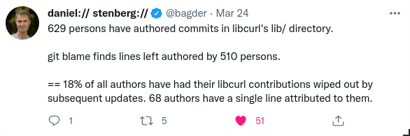
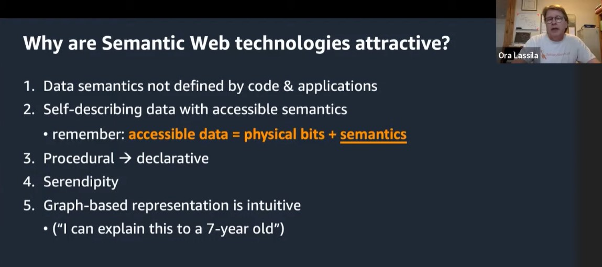
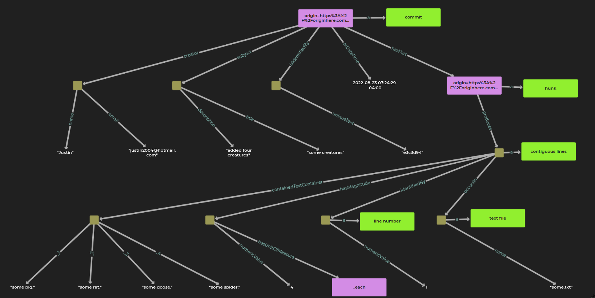

# Git Repositories as RDF Graphs

## Motivation

A while back cURL's creator, Daniel Stenberg, [tweeted](https://twitter.com/bagder/status/1507002666488000514?s=20&t=ZPZXYELS73inW1HuhyIMlw) some stats on cURL's git repository.




I have a pretty good idea about how he answered those questions.
I bet he used some tools like sed, awk, and grep.
If I had to answer those questions I too might use those CLI utilities with a throw away shell pipeline.
But I wondered what it would be like to answer those questions semantic web style.

## What

In order to answer questions semantic web style you first have to find or make some thoughtful RDF.
I say "thoughtful" because it is possible, though mostly not desirable, to use the semantic web stack (RDF/SPARQL/OWL/SHACL, etc.) without doing much domain modeling.

In our case we can easily get some structured data to start with.
Here is a git commit I just made:

```
commit e3c3d94d1748316dce192e76dca0d2baa82e9c27
Author: Justin <justin2004@hotmail.com>
Date:   Tue Aug 23 07:24:29 2022 -0400

    some creatures

    added four creatures

diff --git a/some.txt b/some.txt
new file mode 100644
index 0000000..882149f
--- /dev/null
+++ b/some.txt
@@ -0,0 +1,4 @@
+some pig.
+some rat.
+some goose.
+some spider.
```

Notice how compact that representation is.
The meat of that text is the unified output format of the `diff` tool.
If you work with git much you probably recognize what most of that is.
But the semantic web isn't about just allowing you to work with data you already know how to decipher.
To participate in the semantic web we need to unpack this compact application-centric representation into a [data-centric](http://www.datacentricmanifesto.org/) representation so that others don't need to do the deciphering.
In the semantic web we want data to wear its meaning on its sleeve.

That compact representation is fine for the `diff` and `patch` tools but doesn't really check any of [these boxes](https://youtu.be/f9wautaqWUs?t=1116):




Ok, I ran my conversion tool on that commit and it transformed that representation into a thoughtful RDF graph.

Let's take a look (using [RDFox](https://www.oxfordsemantic.tech/product)'s graph viz):





You'll notice that [commits](https://www.wikidata.org/wiki/Q20058545) have parts: hunks.

Those [hunks](https://www.wikidata.org/wiki/Q113509427), when applied, produce contiguous lines.

Those [contiguous lines](https://www.wikidata.org/wiki/Q113515824):

- occur in a [text file](https://www.wikidata.org/wiki/Q86920) with a name
- are identified by a [line number](https://www.wikidata.org/wiki/Q6553274)
- have a magnitude with a unit of measure (line count)
- and have the literal contained text

Note that I've used [Wikidata](https://www.wikidata.org/) entities because Wikidata is a nice hub in the semantic web.
Here is a Wikidata subgraph with labels that are relevant for the RDF I've produced:

```turtle
@prefix rdfs: <http://www.w3.org/2000/01/rdf-schema#> .
@prefix wd: <http://www.wikidata.org/entity/> .

wd:Q113509427 rdfs:label "hunk"@en .
wd:Q86920 rdfs:label "text file"@en .
wd:Q20058545 rdfs:label "commit"@en .
wd:Q6553274 rdfs:label "line number"@en .
wd:Q113515824 rdfs:label "contiguous lines"@en .
```

By the way, don't let those Q numbers scare you.
I don't memorize them (well I do have [wd:Q2](https://www.wikidata.org/wiki/Q2) memorized since it is pretty special).
I use auto completion in my text editor and Wikidata has it [here](https://query.wikidata.org/) too.
You just type `wd:` then press control-enter then type what you want.
Also, Wikidata has some good reasons for using opaque IRIs.


Here is the RDF graph (the same one as in the image above) in turtle serialization:

```turtle
@prefix :        <http://example.com/> .
@prefix dcterms: <http://purl.org/dc/terms/> .
@prefix gist:    <https://ontologies.semanticarts.com/gist/> .
@prefix rdf:     <http://www.w3.org/1999/02/22-rdf-syntax-ns#> .
@prefix rdfs:    <http://www.w3.org/2000/01/rdf-schema#> .
@prefix schema:  <https://schema.org/> .
@prefix wd:      <http://www.wikidata.org/entity/> .
@prefix xsd:     <http://www.w3.org/2001/XMLSchema#> .

<http://example.com/hunk/origin=https%3A%2F%2Foriginhere.com%2Frepo.git;commit=e3c3d94;hunk=5713fa90-73bc-4520-818f-d59aaf20efb0>
        rdf:type       wd:Q113509427 ;
        gist:produces  [ rdf:type                 wd:Q113515824 ;
                         :containedTextContainer  [ rdf:_1  "some pig." ;
                                                    rdf:_2  "some rat." ;
                                                    rdf:_3  "some goose." ;
                                                    rdf:_4  "some spider."
                                                  ] ;
                         gist:hasMagnitude        [ gist:hasUnitOfMeasure  gist:_each ;
                                                    gist:numericValue      4
                                                  ] ;
                         gist:identifiedBy        [ rdf:type           wd:Q6553274 ;
                                                    gist:numericValue  1
                                                  ] ;
                         gist:occursIn            [ rdf:type   wd:Q86920 ;
                                                    gist:name  "some.txt"
                                                  ]
                       ] .

<http://example.com/commit/origin=https%3A%2F%2Foriginhere.com%2Frepo.git;commit=e3c3d94>
        rdf:type             wd:Q20058545 ;
        dcterms:creator      [ gist:name     "Justin" ;
                               schema:email  "justin2004@hotmail.com"
                             ] ;
        dcterms:subject      [ dcterms:description  "added four creatures" ;
                               dcterms:title        "some creatures"
                             ] ;
        gist:atDateTime      "2022-08-23T07:24:29-04:00"^^xsd:dateTime ;
        gist:hasPart         <http://example.com/hunk/origin=https%3A%2F%2Foriginhere.com%2Frepo.git;commit=e3c3d94;hunk=5713fa90-73bc-4520-818f-d59aaf20efb0> ;
        gist:isIdentifiedBy  [ gist:uniqueText  "e3c3d94" ] .
```


Here is another commit:

```
commit 0e40522a20754fc82d751000eae710b5ad09e2f3
Author: Justin <justin2004@hotmail.com>
Date:   Tue Aug 23 07:25:26 2022 -0400

    capitalization

    caps on pig and spider.

diff --git a/some.txt b/some.txt
index 882149f..c4ef5c5 100644
--- a/some.txt
+++ b/some.txt
@@ -1,4 +1,4 @@
-some pig.
+some Pig.
 some rat.
 some goose.
-some spider.
+some Spider.
```

And the RDF:

```turtle
@prefix :        <http://example.com/> .
@prefix dcterms: <http://purl.org/dc/terms/> .
@prefix gist:    <https://ontologies.semanticarts.com/gist/> .
@prefix rdf:     <http://www.w3.org/1999/02/22-rdf-syntax-ns#> .
@prefix rdfs:    <http://www.w3.org/2000/01/rdf-schema#> .
@prefix schema:  <https://schema.org/> .
@prefix wd:      <http://www.wikidata.org/entity/> .
@prefix xsd:     <http://www.w3.org/2001/XMLSchema#> .

<http://example.com/hunk/origin=https%3A%2F%2Foriginhere.com%2Frepo.git;commit=0e40522;hunk=f2f312bb-49fb-48a1-a62e-323c0519b333>
        rdf:type       wd:Q113509427 ;
        gist:affects   [ rdf:type                 wd:Q113515824 ;
                         :containedTextContainer  [ rdf:_1  "some spider." ] ;
                         gist:hasMagnitude        [ gist:hasUnitOfMeasure  gist:_each ;
                                                    gist:numericValue      1
                                                  ] ;
                         gist:identifiedBy        [ rdf:type           wd:Q6553274 ;
                                                    gist:numericValue  4
                                                  ] ;
                         gist:occursIn            [ rdf:type   wd:Q86920 ;
                                                    gist:name  "some.txt"
                                                  ]
                       ] ;
        gist:produces  [ rdf:type                 wd:Q113515824 ;
                         :containedTextContainer  [ rdf:_1  "some Spider." ] ;
                         gist:hasMagnitude        [ gist:hasUnitOfMeasure  gist:_each ;
                                                    gist:numericValue      1
                                                  ] ;
                         gist:identifiedBy        [ rdf:type           wd:Q6553274 ;
                                                    gist:numericValue  4
                                                  ] ;
                         gist:occursIn            [ rdf:type   wd:Q86920 ;
                                                    gist:name  "some.txt"
                                                  ]
                       ] .

<http://example.com/commit/origin=https%3A%2F%2Foriginhere.com%2Frepo.git;commit=0e40522>
        rdf:type             wd:Q20058545 ;
        dcterms:creator      [ gist:name     "Justin" ;
                               schema:email  "justin2004@hotmail.com"
                             ] ;
        dcterms:subject      [ dcterms:description  "caps on pig and spider." ;
                               dcterms:title        "capitalization"
                             ] ;
        gist:atDateTime      "2022-08-23T07:25:26-04:00"^^xsd:dateTime ;
        gist:hasPart         <http://example.com/hunk/origin=https%3A%2F%2Foriginhere.com%2Frepo.git;commit=0e40522;hunk=eab30641-eab6-4b44-866d-9dc89fb4bc05> , <http://example.com/hunk/origin=https%3A%2F%2Foriginhere.com%2Frepo.git;commit=0e40522;hunk=f2f312bb-49fb-48a1-a62e-323c0519b333> ;
        gist:isIdentifiedBy  [ gist:uniqueText  "0e40522" ] .

<http://example.com/hunk/origin=https%3A%2F%2Foriginhere.com%2Frepo.git;commit=0e40522;hunk=eab30641-eab6-4b44-866d-9dc89fb4bc05>
        rdf:type       wd:Q113509427 ;
        gist:affects   [ rdf:type                 wd:Q113515824 ;
                         :containedTextContainer  [ rdf:_1  "some pig." ] ;
                         gist:hasMagnitude        [ gist:hasUnitOfMeasure  gist:_each ;
                                                    gist:numericValue      1
                                                  ] ;
                         gist:identifiedBy        [ rdf:type           wd:Q6553274 ;
                                                    gist:numericValue  1
                                                  ] ;
                         gist:occursIn            [ rdf:type   wd:Q86920 ;
                                                    gist:name  "some.txt"
                                                  ]
                       ] ;
        gist:produces  [ rdf:type                 wd:Q113515824 ;
                         :containedTextContainer  [ rdf:_1  "some Pig." ] ;
                         gist:hasMagnitude        [ gist:hasUnitOfMeasure  gist:_each ;
                                                    gist:numericValue      1
                                                  ] ;
                         gist:identifiedBy        [ rdf:type           wd:Q6553274 ;
                                                    gist:numericValue  1
                                                  ] ;
                         gist:occursIn            [ rdf:type   wd:Q86920 ;
                                                    gist:name  "some.txt"
                                                  ]
                       ] .

```

You'll notice that this commit does a little more.
The hunk produces contiguous lines as before.
The hunk also affects contiguous lines.
That is because this commit does not add a new file; it changes an existing file by replacing some contiguous lines with some other contiguous lines.


## Why

At this point maybe you're wondering why the data isn't more "direct."
The RDF seems to spread things out and use generic predicates (produces, occurs in, etc.).
That is intentional.

My conversion utility does use some intermediate "direct" data:

```json
{
  "abbreviated_commit_hash": "0e40522",
  "author_name": "Justin",
  "author_email": "justin2004@hotmail.com",
  "author_date": "2022-08-23T07:25:26-04:00",
  "subject": "capitalization",
  "origin": "https://originhere.com/repo.git",
  "body": "caps on pig and spider."
}

[
  {
    "old_source_start_line": "4",
    "new_source_start_line": "4",
    "old_source_line_count": "1",
    "new_source_line_count": "1",
    "old_filename": "some.txt",
    "new_filename": "some.txt",
    "old_content": [
      "some spider."
    ],
    "new_content": [
      "some Spider."
    ],
    "commit-id": "0e40522",
    "origin": "https://originhere.com/repo.git"
  },
  {
    "old_source_start_line": "1",
    "new_source_start_line": "1",
    "old_source_line_count": "1",
    "new_source_line_count": "1",
    "old_filename": "some.txt",
    "new_filename": "some.txt",
    "old_content": [
      "some pig."
    ],
    "new_content": [
      "some Pig."
    ],
    "commit-id": "0e40522",
    "origin": "https://originhere.com/repo.git"
  }
]
```

But that data does not snap together with other data like RDF does.
It does not have formal semantics.
It has not unpacked the meaning of the data.
It is more like an ad hoc projection of data.
It is not something I would want to pass around between applications.


There are some nice things about using RDF to express the content of a git repository.
This is not a comprehensive list but rather just stuff that I thought of while doing this project:

(1)

You can start anywhere with queries.

If you want to find all things with names you just:

```sparql
select * where {
?s gist:name ?name .
}
```

If you want to find all files with names:

```sparql
select * where {
?s a wd:Q86920 .
?s gist:name ?name .
}
```
You don't need to know structurally where these "fields" live.


(2)

You define things in terms of more primitive things.

For example, if you look on Wikidata you'll see that `commit` is defined in terms of `changeset`, and `version control`.
`Hunk` is defined in terms of `diff unified format` and `line`.

Eventually definitions bottom out in really primitive things that aren't defined in terms of anything else.

One of the reasons this is helpful is that you can query against the more primitive things and get back results containing more composite things (built up from the more primitive things).


(3)

You are encouraged (if you use a thoughtful upper ontology such as [Gist](https://github.com/semanticarts/gist)) to unpack meaning.

I think of the semantic web as something like the exploded part diagram for the web's data. 


Yes, it takes up more space than a render of fully assembled thing but all the components you might want to talk about are addressable and their relationship to other components is evident.

One example of how not unpacking makes question answering harder is how Wikidata packs up postal code ranges with an en dash (–).

If you query Wikidata to see what region has postal code "10498" allocated to it you won't find any results.
You'll instead have to write a query to find a postal code (some of them are really a range of postal codes designated with an en dash) by making a procedure that gets the start and stop symbols (numbers in this case) and enumerates the range and does a `where in` or something similar.

If you require users to unpack all your representations before they use them then maybe they'll lose interest and move on to something else.

A thoughtful ontology will help you carve the world at its joints, putting points of articulation between things, by having a thoughtful set of generic predicates.
You might _not_ be using a thoughtful ontology if you can connect any two arbitrary things with a single edge.

The unified output format for diff works well for the `git` and `patch` programs but not for humans asking questions.

Sure, unpacked representations mean more data (triples) but the alternatives (application-centric data, LPGs/RDF-Star, etc.) are like bodge wires:


<!--  -->

They are acceptable for your final act,

, but not something you'd want to build upon.


(4)

RDF allows for incremental enrichment.

As a followup to this project I think it would be interesting to [transform CWEs](https://www.reddit.com/r/semanticweb/comments/t7epy5/common_weakness_enumeration_cwe_in_rdf/) (Common Weakness Enumeration) and CVEs (Common Vulnerabilities and Exposures) into RDF and connect them to the git repositories where the vulnerability producing code is.


(5)

More people can ask questions of the data.

SPARQL is a declarative query language.
The ease of using SPARQL has a bit to do with the thoughtfulness of the domain modeling. 

Below I pose several questions to the data and I obtain answers with SPARQL.


## Answering Questions About cURL

The cURL git repo has about 29k commits and commits going back to 1999. 

My conversion tool turned it into just under 8 million triples in 70 minutes.
I haven't focused on execution efficiency yet.
I wanted to run queries against the data to get a feel the utility of this approach before I refine the tool.

Let's answer some questions about the development of cURL.


---

How many deleted lines per person?

```sparql
PREFIX  :     <http://example.com/>
PREFIX  schema: <https://schema.org/>
PREFIX  gist: <https://ontologies.semanticarts.com/gist/>
PREFIX  rdf:  <http://www.w3.org/1999/02/22-rdf-syntax-ns#>
PREFIX  xsd:  <http://www.w3.org/2001/XMLSchema#>
PREFIX  dcterms: <http://purl.org/dc/terms/>
PREFIX  rdfs: <http://www.w3.org/2000/01/rdf-schema#>
PREFIX  wd:   <http://www.wikidata.org/entity/>
SELECT  ?creator_email (SUM(?num_deleted_lines) AS ?total_deleted_lines)
WHERE
  { ?commit  gist:hasPart ?hunk .
    ?commit dcterms:creator/schema:email ?creator_email .
    ?hunk  gist:affects/gist:hasMagnitude/gist:numericValue ?start_line_count .
    ?hunk  gist:produces/gist:hasMagnitude/gist:numericValue ?end_line_count .
    FILTER ( ?end_line_count < ?start_line_count )
    BIND(( ?start_line_count - ?end_line_count ) AS ?num_deleted_lines)
  }
GROUP BY ?creator_email
ORDER BY DESC(?total_deleted_lines)
```

Result:

|creator\_email      |total\_deleted\_lines|
|--------------------|---------------------|
|daniel@haxx\.se     |316996               |
|yangsita@gmail\.com |35028                |
|info@marc\-hoersken\.de|20653                |
|steve\_holme@hotmail\.com|16097                |
|dan@coneharvesters\.com|6392                 |
|raysatiro@yahoo\.com|4540                 |
|pm@datasphere\.ch   |3986                 |
|tatsuhiro\.t@gmail\.com|3367                 |
|patrick@monnerat\.net|3293                 |
|gvanem@broadpark\.no|2823                 |
|peter@lekensteyn\.nl|2083                 |
|commit@vsz\.me      |1923                 |
|kdudka@redhat\.com  |1876                 |
...


---


How many deleted files per person?

```sparql
PREFIX  :     <http://example.com/>
PREFIX  schema: <https://schema.org/>
PREFIX  gist: <https://ontologies.semanticarts.com/gist/>
PREFIX  rdf:  <http://www.w3.org/1999/02/22-rdf-syntax-ns#>
PREFIX  xsd:  <http://www.w3.org/2001/XMLSchema#>
PREFIX  dcterms: <http://purl.org/dc/terms/>
PREFIX  rdfs: <http://www.w3.org/2000/01/rdf-schema#>
PREFIX  wd:   <http://www.wikidata.org/entity/>
SELECT  ?creator_email (COUNT(?start) AS ?file_count)
WHERE
  { VALUES ?end { "/dev/null" }
    ?commit  gist:hasPart  ?hunk .
    ?commit dcterms:creator/schema:email ?creator_email .
    ?hunk gist:affects/gist:occursIn/gist:name ?start .
    ?hunk gist:produces/gist:occursIn/gist:name ?end
  }
GROUP BY ?creator_email
ORDER BY DESC(?file_count)
```

Result:

|creator\_email      |file\_count |
|--------------------|------------|
|daniel@haxx\.se     |936         |
|yangsita@gmail\.com |39          |
|steve\_holme@hotmail\.com|30          |
|info@marc\-hoersken\.de|14          |
|cmeister2@gmail\.com|13          |
|raysatiro@yahoo\.com|13          |
|wb8tyw@qsl\.net     |12          |
|dan@coneharvesters\.com|10          |
|gvanem@broadpark\.no|7           |
...


---


What files did a particular person delete and when?

```sparql
PREFIX  schema: <https://schema.org/>
PREFIX  dcterms: <http://purl.org/dc/terms/>
PREFIX  gist: <https://ontologies.semanticarts.com/gist/>
SELECT  ?creator_email ?start_file ?at
WHERE
  { VALUES ?end_file { "/dev/null" }
    VALUES ?creator_email { "1983-01-06@gmx.net" }
    ?commit gist:hasPart  ?hunk .
    ?commit dcterms:creator/schema:email ?creator_email .
    ?commit gist:atDateTime  ?at .
    ?hunk gist:affects/gist:occursIn/gist:name ?start_file .
    ?hunk gist:produces/gist:occursIn/gist:name ?end_file
  }
```

Result:

|creator\_email      |start\_file    |at                         |
|--------------------|---------------|---------------------------|
|1983\-01\-06@gmx\.net|install\-sh    |2015\-04\-29T22:51:04\+02:00|
|1983\-01\-06@gmx\.net|mkinstalldirs  |2015\-04\-29T22:51:04\+02:00|
|1983\-01\-06@gmx\.net|missing        |2015\-04\-30T10:06:09\+02:00|


---


Which commits affected lib/http.c in 2019 only?

```sparql
PREFIX  schema: <https://schema.org/>
PREFIX  xsd:  <http://www.w3.org/2001/XMLSchema#>
PREFIX  dcterms: <http://purl.org/dc/terms/>
PREFIX  gist: <https://ontologies.semanticarts.com/gist/>
SELECT DISTINCT  ?commit_id ?creator_email ?creator_name ?at
WHERE
  { VALUES ?start_file {"lib/http.c"}
    ?commit  gist:hasPart  ?hunk .
    ?commit gist:isIdentifiedBy/gist:uniqueText ?commit_id .
    ?commit  gist:atDateTime  ?at .
    ?hunk gist:affects/gist:occursIn/gist:name ?start_file
    OPTIONAL
      { ?commit dcterms:creator/schema:email ?creator_email }
    OPTIONAL
      { ?commit dcterms:creator/gist:name ?creator_name }
    FILTER ( ( ?at >= "2019-01-01T00:00:00"^^xsd:dateTime ) &&
             ( ?at < "2020-01-01T00:00:00"^^xsd:dateTime ) )
  }
ORDER BY ?at
```


Result:

|commit\_id |creator\_email      |creator\_name      |at                         |
|-----------|--------------------|-------------------|---------------------------|
|ebe658c1e  |daniel@haxx\.se     |Daniel Stenberg    |2019\-01\-04T23:34:50\+01:00|
|05b100aee  |daniel@haxx\.se     |Daniel Stenberg    |2019\-02\-08T09:33:42\+01:00|
|942eb09e8  |daniel@haxx\.se     |Daniel Stenberg    |2019\-02\-18T08:14:52\+01:00|
|62a2534e4  |daniel@haxx\.se     |Daniel Stenberg    |2019\-02\-25T11:17:53\+01:00|
|f1d915ea4  |daniel@haxx\.se     |Daniel Stenberg    |2019\-02\-27T22:30:32\+01:00|
|65eb65fde  |daniel@haxx\.se     |Daniel Stenberg    |2019\-02\-28T11:36:26\+01:00|
|5345b04a4  |daniel@haxx\.se     |Daniel Stenberg    |2019\-03\-03T11:17:52\+01:00|
|dd8a19f8a  |mschlatter@gestour\.com|Marc Schlatter     |2019\-03\-11T17:15:34\+01:00|
|2f44e94ef  |daniel@haxx\.se     |Daniel Stenberg    |2019\-04\-05T16:38:36\+02:00|
...


---


Which persons have authored commits with the same email but different names?

```sparql
PREFIX  schema: <https://schema.org/>
PREFIX  dcterms: <http://purl.org/dc/terms/>
PREFIX  gist: <https://ontologies.semanticarts.com/gist/>
SELECT  ?creator_email ?creator_name
WHERE
  { { SELECT  ?creator_email (COUNT(DISTINCT ?creator_name) AS ?creator_name_count)
      WHERE
        { ?commit dcterms:creator/schema:email ?creator_email .
          ?commit dcterms:creator/gist:name ?creator_name
        }
      GROUP BY ?creator_email
      HAVING ( COUNT(DISTINCT ?creator_name) > 1 )
    }
    { SELECT DISTINCT  ?creator_email ?creator_name
      WHERE
        { ?commit dcterms:creator/schema:email ?creator_email .
          ?commit dcterms:creator/gist:name ?creator_name
        }
    }
  }
ORDER BY DESC(?creator_name_count) ?creator_email
```

Result:


|creator\_email      |creator\_name            |
|--------------------|-------------------------|
|                    |Ian Blanes               |
|                    |Thomas Vegas             |
|                    |z2\_ on hackerone        |
|k2k@narod\.ru       |Evgeny Grin              |
|k2k@narod\.ru       |Evgeny Grin \(Karlson2k\)|
|k2k@narod\.ru       |Karlson2k                |
|yasuharu\.yamada@access\-company\.com|YAMADA Yasuharu          |
|yasuharu\.yamada@access\-company\.com|Yamada Yasuharu          |
|yasuharu\.yamada@access\-company\.com|Yasuharu Yamada          |
|47042125\+pheiduck@users\.noreply\.github\.com|Philip H                 |
|47042125\+pheiduck@users\.noreply\.github\.com|pheiduck on githuh       |
|5984479\+neutric@users\.noreply\.github\.com|neutric                  |
|5984479\+neutric@users\.noreply\.github\.com|neutric on github        |
|Niall\.oReilly@ucd\.ie|Niall                    |
|Niall\.oReilly@ucd\.ie|Niall O'Reilly           |
...


---


Which persons have authored commits with the same name and different email?

```sparql
PREFIX  schema: <https://schema.org/>
PREFIX  dcterms: <http://purl.org/dc/terms/>
PREFIX  gist: <https://ontologies.semanticarts.com/gist/>
SELECT  ?creator_email ?creator_name
WHERE
  { { SELECT  ?creator_name (COUNT(DISTINCT ?creator_email) AS ?creator_email_count)
      WHERE
        { ?commit dcterms:creator/schema:email ?creator_email .
          ?commit dcterms:creator/gist:name ?creator_name
        }
      GROUP BY ?creator_name
      HAVING ( COUNT(DISTINCT ?creator_email) > 1 )
    }
    { SELECT DISTINCT  ?creator_email ?creator_name
      WHERE
        { ?commit dcterms:creator/schema:email ?creator_email .
          ?commit dcterms:creator/gist:name ?creator_name
        }
    }
  }
ORDER BY DESC(?creator_email_count) ?creator_name
```

Result:


|creator\_email      |creator\_name            |
|--------------------|-------------------------|
|Marcel\.Raad@teamviewer\.com|Marcel Raad              |
|MarcelRaad@users\.noreply\.github\.com|Marcel Raad              |
|marcelraad@users\.sf\.net|Marcel Raad              |
|raad@teamviewer\.com|Marcel Raad              |
|Patrick\.Monnerat@datasphere\.ch|Patrick Monnerat         |
|patrick\.monnerat@dh\.com|Patrick Monnerat         |
|patrick@monnerat\.net|Patrick Monnerat         |
|pm@datasphere\.ch   |Patrick Monnerat         |
|al3xbio@gmail\.com  |Alessandro Ghedini       |
|alessandro@cloudflare\.com|Alessandro Ghedini       |
|alessandro@ghedini\.me|Alessandro Ghedini       |
...


---


Which persons have authored commits in libcurl's lib/ directory (this includes deleting something in there)?

```sparql
PREFIX  schema: <https://schema.org/>
PREFIX  xsd:  <http://www.w3.org/2001/XMLSchema#>
PREFIX  dcterms: <http://purl.org/dc/terms/>
PREFIX  gist: <https://ontologies.semanticarts.com/gist/>
SELECT DISTINCT  ?creator_email ?creator_name   # 727
# SELECT DISTINCT  ?creator_name   # 678
# SELECT DISTINCT  ?creator_email   # 699
WHERE
  { ?commit  gist:hasPart  ?hunk
    OPTIONAL
      { ?hunk gist:affects/gist:occursIn/gist:name ?start_file }
    OPTIONAL
      { ?hunk gist:produces/gist:occursIn/gist:name ?end_file }
    OPTIONAL
      { ?commit dcterms:creator/schema:email ?creator_email }
    OPTIONAL
      { ?commit dcterms:creator/gist:name ?creator_name }
    FILTER ( regex(?start_file, "^lib/") || regex(?end_file, "^lib/") )
  }
```

Result:


|creator\_email      |creator\_name                    |
|--------------------|---------------------------------|
|daniel@haxx\.se     |Daniel Stenberg                  |
|sterling@bumblebury\.com|Sterling Hughes                  |
|sm@resistor\.net    |sm                               |
|Joern\.Hartroth@comma\-soft\.com|Joern Hartroth                   |
|jpbarrette@gmail\.com|Jean\-Philippe Barette\-LaPierre |
...

And depending on how you count the people the query finds between 678 and 727 people that authored commits in libcurl's lib/ directory.
That was Daniel's first question.
He got 629 with his method but that was a few months ago and I don't know exactly what his method of counting was.
He may not have included the act of deleting a file in that directory like I did.

To answer his next three questions I'd need to record each commit's parent commit (I don't yet -- one of my many TODOs) and simulate the application of hunks in SPARQL or add the output of `git blame` to the RDF.
Daniel likely used the output of `git blame`.
I'll think about adding it to the RDF.

## How

In another blog post I might describe how the conversion utility works.
It is written in Clojure and it uses [SPARQL Anything](https://github.com/SPARQL-Anything/sparql.anything) (which is built upon [Apache Jena](https://jena.apache.org/)).
I expect to push it to Github soon.

## Closing Thoughts

It is fun to imagine having all the git repos in Github as RDF graphs in a massive triplestore and asking questions with SPARQL.

In my example queries I didn't make use of the fact that each source code line is in the RDF.
Most triplestores have full text search capabilities so I'll write some queries that make use of that too. 
In general I haven't been overly impressed with search built-into Gitlab and Bitbucket (I haven't used Github's search much) so I wonder if keeping an RDF representation with full text search would be a useful approach. I'd love to see a SPARQL endpoints for searching hosted git platforms!

I think this technique could be applied to other application-centric file formats. 
SPARQL Anything gets you part of the way there for [several file formats](https://github.com/SPARQL-Anything/sparql.anything#supported-formats) but I'd like to hear if you have other ideas.

Please feel free to start a discussion above if you have ideas!

