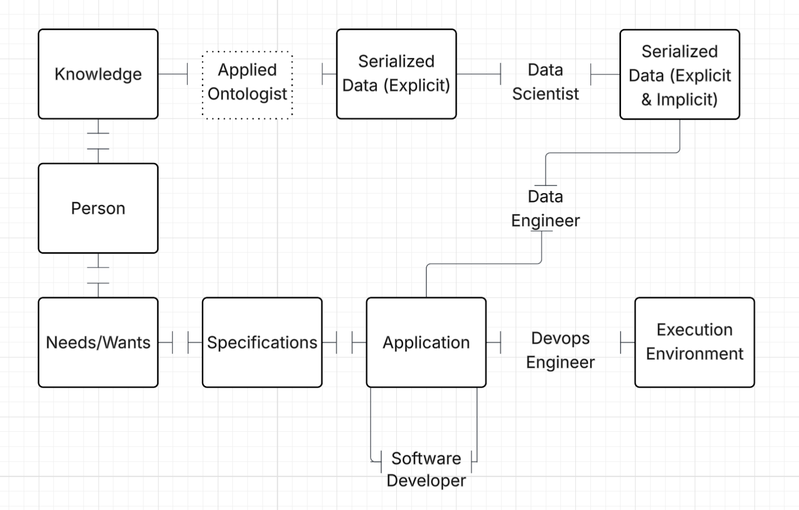

##### DRAFT

# Interfaces and Personalities

I work in the software development space and I have been noticing patterns between the personalities involved in the development process and the resultant software product.

The patterns are evident between (a) the personalities assigned to work on interfaces and (b) the maneuverability of the final product.

Interfaces are, of course, points where two things meet and interact.
And I see the personalities as: a tendency to focus on a particular interface.

In software development the things interacting are:

- People
- Knowledge
- Needs/Wants
- Specifications
- Applications
- Execution Environments
- Serialized Data
  - Explicit
  - Implicit

We could slice up the space differently but I think this set of things gives rise to the interfaces that are most worthy of discussion.

There are interfaces between each of those things to all the other things but I think only a handful of those interfaces account for the most amount of product quality variation between software implementations.

I mostly want to compare (a) the interfaces between applications and (b) the interfaces between knowledge and serialized data.
I'll also enumerate some of the nearby interfaces just to situate the comparison.
I don't have a name for these interfaces but I have a personality that tends to focus on them:

By varying the amount of attention each of these personalities put into a software product you can vary some important operational characteristics of the software.

It isn't always the case that you get a person or role for each personality type.
Sometimes one person represents several of the personalities but I don't think I've ever come across a person that represents all of them.

Let's look at each of them in turn.

## Between Application and Application

The interface between applications is a focus of the personality "software engineer."

Software engineers focus on more than just the interface between applications but their focus on this is what makes the resultant software seem more "developer friendly."
This personality puts work into interfaces that other applications can use (APIs).
Allowing this personality to have the majority vote in design often results in software that this personality likes to use.

-- some circularity here? --

The software engineer personality invents APIs with a mind for only their applications needs (not the needs of the ecosystem around it).

This personality almost always gets overrepresented.
Because of that, software that is developed is lopsided (more application-centric than data-centric) which results in the [Software Wasteland](https://www.amazon.com/Software-Wasteland-Application-Centric-Hobbling-Enterprises/dp/1634623169).

## Between Application and Execution Environment
The interface between applications and execution environments: "DevOps engineer"

Without some attention to this interface you'll likely get an application that won't easily run in other execution environments.

## Between Application and Serialized Data
The interface between Applications and Serialized Data is a focus of the personality: "Data Engineer"

When you think of enterprise software, that almost always entails some kind of ETL (extracting, transforming, and loading data).
This is the domain of the data engineer personality.

## Between Serialized Data (explicit) and Serialized Data (implicit)

Serialized Data (explicit) and Serialized Data (implicit): "Data Scientist"

This is the personality that is doing AI/ML.
This work is about taking some input (serialized data) and doing some computations and producing some output (serialized data).
Most often the output data is implicit, in that it was derivable from the input but the input did not explicitly state it.

e.g. 
From the input "Owen has 2 apples. He gives 1 to his dad." you can derive "Owen now has 1 apple" as it is an implicit fact based on the input and the background worldview (including the axiom that apples are [rivalrous goods](https://en.wikipedia.org/wiki/Rivalry_(economics)).

To do useful derivations (that aren't easily obtained) you often need multiple different input data sources.
You can use any mechanism to produce these derivations: algebra, regression analysis, deductive logic, artificial neural networks, and LLMs.

This personalty has been historically told to "produce insights."
And these days this personality is told to "take loosey-goosey input and do the right thing."
I've also written (pre-ChatGPT) about such loosey-goosey input [here](https://github.com/justin2004/weblog/tree/master/semantic_messages). 

## Between Knowledge and Serialized Data

Knowledge and Serialized Data: "Applied Ontologist"

This personality is the most under represented in software development and it results in systems that work for narrow purposes and do not adapt well to variations on those purposes and new purposes.

When this personality is under represented you get software that:
- has data schemata for its narrow purposes
- takes "stay in your lane" to an extreme
- entangles the meaning of serialized data with the code that handles it
  - such that it takes significant effort to migrate data out of one system and into another
- assumes someone else will be the one doing the ETL to get data in and out

The work of this personality is: expressing knowledge and situations using the terminology of a particular worldview.

Let's consider how a software engineer and an applied ontologist would approach the design of an inventory system.

What would the software engineer personality prioritize while developing an inventory system?
They'd prioritize the design of a back-end to do CRUD (create, read, update, delete) via an API.

Contrast that to what an applied ontologist would prioritize:
They'd prioritize building a representation of the knowledge about the relevant details (and adjacent details -- enough to contextualize the particulars of this application) of inventory within a particular worldview.
