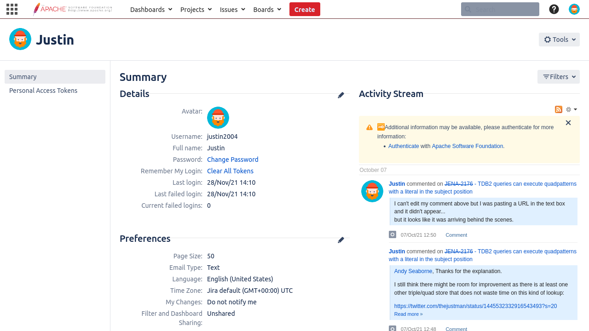

# Scraping Webpages with SPARQL

## Intro

Sometimes you want some data that does not sit behind an application friendly API.
The friendliest API is a SPARQL endpoint.
Using [SPARQL Anything]() you can view many APIs as approximations of SPARQL endpoints.
You can even view webpages as approximations of SPARQL endpoints.

In this post I am going to be scraping some data from Apache's JIRA.
I created an issue for Apache Jena a while back and I am going to pretend I want to be reminded of my activity on that issue.
Let's also pretend that Apache's JIRA doesn't have a more friendly REST API (because sometimes even if one exists you may not have access to use it.).

[This](https://issues.apache.org/jira/secure/ViewProfile.jspa) is the URL we'll be scraping.

Things to note:

- You have to be logged into this page to see your activity stream
- To see your activity stream you need javascript to interpret the webpage
- Web Browsers (I am using Firefox) emit events as pages load
    - ["The DOMContentLoaded event fires when the initial HTML document has been completely loaded and parsed, without waiting for stylesheets, images, and subframes to finish loading."](https://developer.mozilla.org/en-US/docs/Web/API/Window/DOMContentLoaded_event)
    - ["A different event, load, should be used only to detect a fully-loaded page."](https://developer.mozilla.org/en-US/docs/Web/API/Window/DOMContentLoaded_event)
- Sometimes content is still loading into a webpage even after the "load" event fires so you might need to be able to wait to scrape the content you want

SPARQL Anything can handle all of that with your assistance.

I'll break the process down a little bit (assuming you've never scraped a webpage before).

## Login

We are just going to do the cheap approach: login with our browser then get the [cookie](https://en.wikipedia.org/wiki/HTTP_cookie) manually.

Log in with your credentials and navigate to the page you want to scrape.

Open your Inspector and go to the Network tab.

Scroll up the to first request and click it.
In the headers tab you should see Request Headers (I've obscured my cookie value).
Usually Request Headers have all the information you need to send to the website in order to scrape.
Copy information into your SPARQL query as needed.

## Write a hello world SPARQL (construct) query to see if it works

```sparql
curl --silent 'http://localhost:3000/sparql.anything'  \
--data-urlencode 'query=
PREFIX xyz: <http://sparql.xyz/facade-x/data/>
PREFIX ns: <http://sparql.xyz/facade-x/ns/>
PREFIX rdf: <http://www.w3.org/1999/02/22-rdf-syntax-ns#>
PREFIX fx: <http://sparql.xyz/facade-x/ns/>
prefix skos: <http://www.w3.org/2004/02/skos/core#>
prefix what: <https://html.spec.whatwg.org/#>
prefix xhtml: <http://www.w3.org/1999/xhtml#> 
prefix ex: <http://www.example.com/>
PREFIX xsd: <http://www.w3.org/2001/XMLSchema#>
construct {?s ?p ?o}           
WHERE {                          
service <x-sparql-anything:> {                     
fx:properties fx:location "https://issues.apache.org/jira/secure/ViewProfile.jspa" .
fx:properties fx:media-type "text/html" .        
fx:properties fx:html.browser "firefox" .
fx:properties fx:html.browser.screenshot "file:///app/screenie.png" .
fx:properties fx:html.browser.wait "5" .
fx:properties fx:http.header.User-Agent "Mozilla/5.0 (X11; Ubuntu; Linux x86_64; rv:78.0) Gecko/20100101 Firefox/78.0" .
fx:properties fx:http.header.Cookie "atlassian.xsrf.token=BLAHBLAH..." .
?s ?p ?o .
}
}'
```

Which yields triples (in turtle format):
```
@prefix ex:    <http://www.example.com/> .
@prefix fx:    <http://sparql.xyz/facade-x/ns/> .
@prefix ns:    <http://sparql.xyz/facade-x/ns/> .
@prefix rdf:   <http://www.w3.org/1999/02/22-rdf-syntax-ns#> .
@prefix skos:  <http://www.w3.org/2004/02/skos/core#> .
@prefix what:  <https://html.spec.whatwg.org/#> .
@prefix xhtml: <http://www.w3.org/1999/xhtml#> .
@prefix xsd:   <http://www.w3.org/2001/XMLSchema#> .
@prefix xyz:   <http://sparql.xyz/facade-x/data/> .

[ rdf:type                     xhtml:html , ns:root ;
  rdf:_1                       [ rdf:type        xhtml:head ;
                                 rdf:_1          [ rdf:type       xhtml:meta ;
                                                   xhtml:charset  "utf-8"
                                                 ] ;
...
```

You'll notice in my query that I said:

The URL is:
`fx:properties fx:location "https://issues.apache.org/jira/secure/ViewProfile.jspa" .`

Expect html content:
`fx:properties fx:media-type "text/html" .`        

Use a headless browser (firefox):
`fx:properties fx:html.browser "firefox" .`

Take a screenshot (in case we need to troubleshoot) and save it here:
`fx:properties fx:html.browser.screenshot "file:///app/screenie.png" .`

After the "load" event is emitted wait 5 seconds:
`fx:properties fx:html.browser.wait "5" .`

Send the following two HTTP headers (that we copied from the Inspector earlier):
```
fx:properties fx:http.header.User-Agent "Mozilla/5.0 (X11; Ubuntu; Linux x86_64; rv:78.0) Gecko/20100101 Firefox/78.0" .
fx:properties fx:http.header.Cookie "atlassian.xsrf.token=BLAHBLAH..." .
```

In this case if you don't wait a few seconds your content won't be loaded:


## Pick the HTML elements you need



