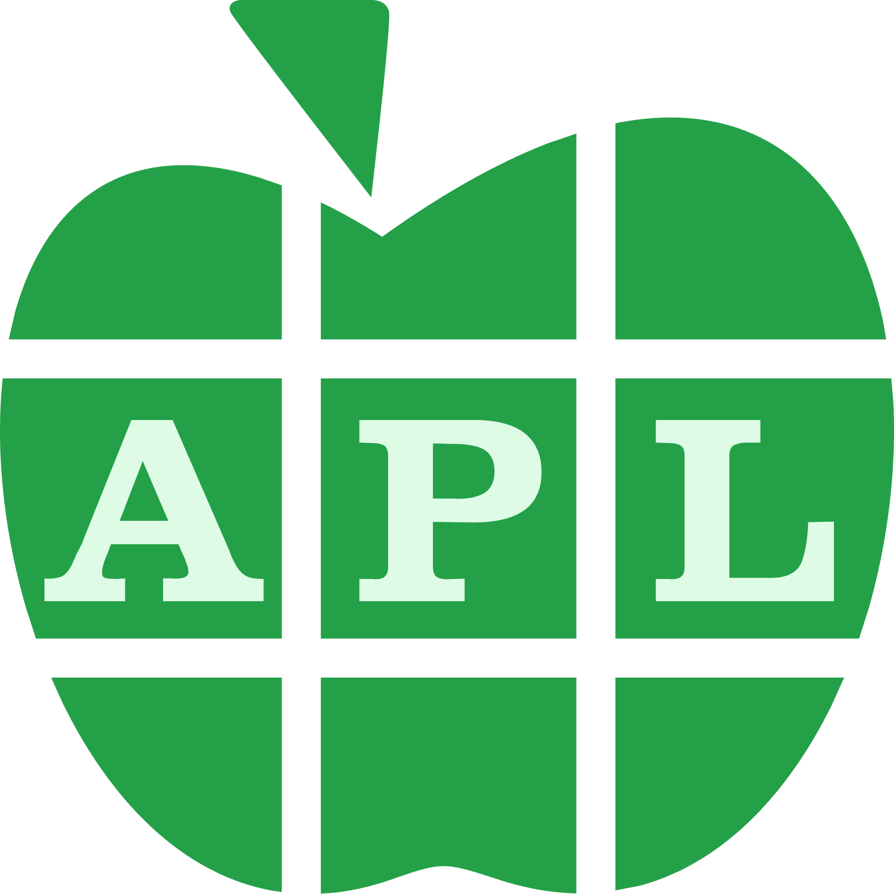
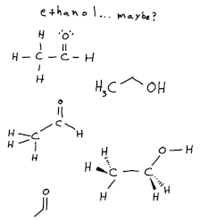

# How It Feels To Use APL


## APL 



APL is A Programming Language.
<!--  -->
It works quite well when you are working with data that is or can be viewed as a rectangular collection of elements.

I've used it to [teach image processing](https://github.com/justin2004/image-processing#image-processing-with-apl) to students.

In APL the number of primitives (functions and operators) you need to know is pretty small.
Each primitive consists of a single character.

Here they are:
```
! * < = > ? | ~ ¨ ¯ × ÷ ← ↑ → ↓ ∆ ∇ ∊ ∘ 
∧ ∨ ∩ ∪ ≠ ≡ ≢ ≤ ≥ ⊂ ⊃ ⊆ ⊖ ⊢ ⊣ ⊤ ⊥ ⋄ ⌈ ⌊ 
⌷ ⌸ ⌹ ⌺ ⌽ ⌿ ⍀ ⍉ ⍋ ⍎ ⍒ ⍕ ⍙ ⍝ ⍞ ⍟ ⍠ ⍣ ⍤ ⍥ 
⍨ ⍪ ⍫ ⍬ ⍱ ⍲ ⍳ ⍴ ⍵ ⍷ ⍸ ⍺ ⎕ ○
```

Entering the characters on a standard keyboard is [not a problem](https://aplwiki.com/wiki/Typing_glyphs#By_platform).

## What Is APL Though?

["Is [APL] just a set of well-chosen matrix operators?"](https://news.ycombinator.com/item?id=17186378)

APL does have a thoughtfully chosen set of array primitives.
The primitive coverage feels like it approaches a periodic table of computational process behavior: everything you need to efficiently express any computation.
You can do anything with it and you can often do things with a [surprisingly small amount of primitives](https://www.youtube.com/watch?v=a9xAKttWgP4).

[But there is more to this language.](https://news.ycombinator.com/item?id=17186470)


## How it feels to use it

To me, programming in APL feels like designing molecules.
I like Clojure a lot but programming in Clojure doesn't feel like that.
I've never designed a molecule so this blog post is meant to be evocative and is based on my subjective impressions and associations.


If you want to invoke or reference a function in most programming languages you have to spell the name of the function.
Often APL programmers talk of "the spelling of a function in APL" but they mean something different.

APL programmers might say "arithmetic mean (or average) is spelled `+/÷≢` in APL"

I suppose an APL expression is like a spelling in that there are typographical items that you string together.
But APL expressions (specifically [trains](https://help.dyalog.com/18.2/index.htm#Language/Introduction/Trains.htm)) feel like condensed [structural formulae](https://en.wikipedia.org/wiki/Structural_formula) of computational processes.
A structural formula of a molecule shows how the constituent atoms (primitives) are bonded together.


CH<sub>3</sub>CH<sub>2</sub>OH



An APL expression is a condensed formula that indicates how the language primitives should be bonded together.

In fact, if you express a function in a [Dyalog APL REPL](https://tryapl.org/) you'll see a tree rendering of the derived function.

```
      +/÷≢
  ┌─┼─┐
  / ÷ ≢
┌─┘    
+ 
```

The tree diagrams of derived functions are one way Dyalog APL renders the bonding of primitives in what it calls trains.
Those tree diagrams and structural formulas are helpful for visualizing how the molecule's parts contribute to the whole which will interact with their surroundings (arguments or chemical entities, respectively).

## Example Time

Let's look at an example.
Let's say you want to put a comma between each item in a sequence.
In Clojure we can use `interpose` to do that. 
The Clojure core has already assigned a function to that name.

```clojure
(interpose "," (range 1 10))
=> (1 "," 2 "," 3 "," 4 "," 5 "," 6 "," 7 "," 8 "," 9)
```

In Clojure you spell the name of the function ("interpose" in this example).
But `interpose` is just a name and interpose itself is really [elsewhere](https://github.com/clojure/clojure/blob/35bd89f05f8dc4aec47001ca10fe9163abc02ea6/src/clj/clojure/core.clj#L5231).

It isn't really convenient to break Clojure's interpose into pieces and re-mix the parts to do something different.
It is intended that interpose is one of your primitives.

In APL you reference interpose behavior directly (without going through a name):

```apl
      1↓,',',⍪⍳9
1 , 2 , 3 , 4 , 5 , 6 , 7 , 8 , 9
```
All the parts of APL's interpose are exposed and the re-mixing potential is immediate.

Let's step through that APL expression (in APL evaluation is right to left).

[iota](https://help.dyalog.com/18.2/Content/Language/Symbols/Iota.htm) 9

```apl
      ⍳9
      1 2 3 4 5 6 7 8 9
```

Let's think of that as the argument and what we do next as the interpose behavior.

[table](https://help.dyalog.com/18.2/Content/Language/Symbols/Comma%20Bar.htm) it

```apl
      ⍪⍳9
1
2
3
4
5
6
7
8
9
```

[catenate](https://help.dyalog.com/18.2/Content/Language/Symbols/Comma.htm#kanchor3327) the character `,` onto the matrix (with [scalar extension](https://aplwiki.com/wiki/Scalar_extension)) 

```apl
      ',',⍪⍳9
, 1
, 2
, 3
, 4
, 5
, 6
, 7
, 8
, 9
```

[ravel](https://help.dyalog.com/18.2/Content/Language/Symbols/Comma.htm#kanchor3325) it

```apl
      ,',',⍪⍳9
, 1 , 2 , 3 , 4 , 5 , 6 , 7 , 8 , 9
```

1 [drop](https://help.dyalog.com/18.2/Content/Language/Symbols/Down%20Arrow.htm#kanchor1111) to remove the unwanted leading comma

```apl
      1↓,',',⍪⍳9
1 , 2 , 3 , 4 , 5 , 6 , 7 , 8 , 9
```

Sometimes you just build an expression up like this and you're done.

But the resultant expression isn't a function so you can't name it, pass actual arguments to it, etc.
```apl
      1↓,',',⍪
      SYNTAX ERROR: Missing right argument
```

But you could turn that expression into a function (in this case by using ∘ [jot](https://help.dyalog.com/18.2/Content/Language/Symbols/Jot.htm)).

```apl
      1∘↓∘,','∘,∘⍪
  ┌─┴─┐ 
  ∘   ∘ 
 ┌┴┐ ┌┴┐
 ∘ , ∘ ⍪
┌┴┐ ┌┴┐ 
1 ↓ , , 
```


Also here is another way to formulate interpose with an APL function:

```apl
      (⊣,',',⊢)/
    /    
  ┌─┘    
┌─┼───┐  
⊣ , ┌─┼─┐
    , , ⊢
```


## Summary Of How It Feels To Use APL

In APL it feels like you are making molecules with atoms (language primitives) and bonds (combinators/trains).
The spelling of the name of the molecule _is_ the molecule.
The name isn't a layer of indirection; it is directly the entity.


## If the Molecule Needs More Work

Instead of 1,2,3,4,5,6,7,8,9 what if I want pairs partitioned like: 1 2 , 3 4 , 5 6 , 7 8

In Clojure you could reference, by name, another function: `partition`.


```
(interpose "," (partition 2 (range 1 10)))
=> ((1 2) "," (3 4) "," (5 6) "," (7 8))
```

Close enough.

In APL you can get partition behavior by first reshaping the vector into a matrix.
Below we'll use a train to compute the desired shape of the matrix.
You'll notice that in trains you don't reference arguments explicitly.
Trains are a form of [tacit programming](https://en.wikipedia.org/wiki/Tacit_programming).

Here is the train to compute the desired shape:
```apl
      (,∘2)(⌊÷∘2)
 ┌─┴─┐  
 ∘  ┌┴┐ 
┌┴┐ ⌊ ∘ 
, 2  ┌┴┐
     ÷ 2
```

Using it looks like:
```apl
      (,∘2)(⌊÷∘2) 9
4 2
```
We'll use the result, the vector `4 2`, as the desired shape of the matrix.
That is, we want to [reshape](https://help.dyalog.com/18.2/Content/Language/Symbols/Rho.htm#kanchor2859) (with ⍴) the argument (a vector) into a matrix with 4 rows 2 columns.


```apl
      ⍳9
1 2 3 4 5 6 7 8 9
      4 2⍴⍳9
1 2
3 4
5 6
7 8
```


And then we embed that train into another train:
```apl
      ((,∘2)(⌊÷∘2))⍴⍳
   ┌───┼─┐
 ┌─┴─┐ ⍴ ⍳
 ∘  ┌┴┐   
┌┴┐ ⌊ ∘   
, 2  ┌┴┐  
     ÷ 2 
```

Then we just need to follow up with the expression (that we used a moment ago):
```apl
      1↓,',',
```

Which will:

- catenate (left and right argument given to `,`): concatenate the comma onto each row of the matrix
- ravel (right argument given to `,`): turn the matrix into a vector
- drop (right argument given to `↓`): drop the leading comma


All together:
```apl
      1↓,',',(((,∘2)(⌊÷∘2))⍴⍳) 9
1 2 , 3 4 , 5 6 , 7 8
```


# Is all this chemistry mostly because of APL's single character primitives?

Maybe.

Single character primitives mean you have less to overcome to express something that can stand alone.
As you type `i` `n` `t` `e` `r` `p` `o` `s` `e` none of that stands alone until you finish the final character.
In APL every primitive (well except the operators) can stand alone.

My 5 year old son does almost any action, that he wants to do, quickly and with cheerfulness.
He has very little to overcome to perform an action.
He doesn't believe the action might be of little value and therefore not worth the effort.
He has enough energy to do the action.

Adults, on the other hand, [need to hear reasons](https://youtu.be/7jVr0-ghGWU?t=26) before they get out of their chairs.

"At my age if I'm sitting down and somebody tells me I need to get up and go in another room I need to be told all the information why first." - Louis CK

```c
for(i=0;i<⍵;i++)
```
feels tedious, like getting up out of my chair and going into another room.

I bet Louis would be much more willing to just move his eyes to look at something upon request.

```apl
⍳ 
```
feels atomic, light, and almost reflexive like moving only my eyes to look at something.


```clojure
(range)
```
feels like something in between... maybe like scooting down a seat so someone can sit next to me.

# Conclusion

I'm not sure if the chemistry analogy was necessary but it seemed fun which was enough to motivate this blog post.
