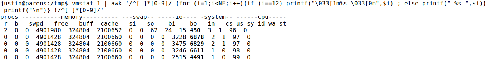

# Three Independent Dimensions of Work on Engineered Artifacts
### And The Cost of Not Moving Freely In All Three

<br/>


Before I started working as a software engineer I worked on [F-16s](https://en.wikipedia.org/wiki/General_Dynamics_F-16_Fighting_Falcon). 
Specifically, I worked on the F-16 electrical and environmental systems (E&E).

As a software engineer, I used to work for a consultancy and I would get dispatched to diagnose and troubleshoot problems with multi-tier architecture systems.

Work on engineered artifacts like F-16s and multi-tier architecture software systems can be characterized by three independent dimensions. I am going to contrast work on these two types of systems to show the cost of not allowing free movement in all three dimensions.

## Some Definitions

### The Posture dimension: 
#### from development to sustainment

- **development**: The system does not fully exist yet. It is actively being designed/engineered/developed.

- **sustainment**: The system (or some part of it) exists. It is in use but it might require attention to keep it in use.


### The Intent dimension:
#### from monitoring to troubleshooting

- **monitoring**: The system (or some part of it) is in use and it is being watched for deviations from normal/optimal/expected.

- **troubleshooting**: A deviation from normal/optimal/expected (in the system or some part of it) has been detected and a search for a resolution is underway.


### The Access dimension:
#### from preplanned telemetry to ad hoc telemetry

- **preplanned telemetry**: Measurements can be read (on some part of the system) that the designers explicitly allowed for.

- **ad hoc telemetry**: Measurements can be read (on some part of the system) that the designers did not explicitly allow for.

<br/>

## The Plan

Since these three dimensions are independent there are eight saturated ways to be situated in this space.
I am going to skip:

- Posture: development, Intent: monitoring, Access: preplanned telemetry
- Posture: development, Intent: monitoring, Access: ad hoc telemetry
- Posture: development, Intent: troubleshooting, Access: preplanned telemetry
- Posture: development, Intent: troubleshooting, Access: ad hoc telemetry

I am skipping these because I didn't do development on any part of the F-16.

I am going to discuss:

- Posture: sustainment, Intent: monitoring, Access: preplanned telemetry
- Posture: sustainment, Intent: monitoring, Access: ad hoc telemetry
- Posture: sustainment, Intent: troubleshooting, Access: preplanned telemetry
- Posture: sustainment, Intent: troubleshooting, Access: ad hoc telemetry

### The Cost of Not Moving Freely In All Three

In the F-16 world, movement along the intent and access dimensions is so smooth you don't even notice it.
That is, for most problems with the F-16 E&E systems the hardest part is finding the problem. [9]

In the software world, movement along the intent and access dimensions is so rough that it causes:

- increased disappointment in deployed software systems

- increased cost (time, money, and attention)

- increased personnel and technology stack churn

- decreased [systems programming](https://en.wikipedia.org/wiki/Systems_programming) ability [5]

That is, for a significant portion of the non-trivial problems with multi-tier architecture software systems the hardest part is getting the elevated access to do (single mind) ad hoc telemetry based troubleshooting.


## Posture: sustainment, Intent: monitoring, Access: preplanned telemetry

In the F-16 world, the pilot has a master caution light which gets latched by dozens of system caution and warning lights.
Aside from the flight centric instruments, the pilot also has some analog gauges for fuel pressure, engine RPM, engine temperature, fuel level, liquid oxygen level, etc.
The lights and gauges are the pilot's interface to the preplanned telemetry system put in place at aircraft design time.
These lights and gauges let the pilot know when she needs to take action to keep the jet in the air.


In the software world, monitoring is big business.
You may have heard of some monitoring systems:

- New Relic

- Datadog

- Nagios

- Prometheus

They are often advertised as a "single pane of glass." [1]

They've got metrics over time and which can be shown on a graph (and maybe even add a bright dashed "red line" to the graph). [8]


## Posture: sustainment, Intent: monitoring, Access: ad hoc telemetry

The F-16 doesn't really have anything that fits in this category.
The pilot can't decide to check the voltage at the air refueling door actuator.
She doesn't have a multimeter and she can't climb around the jet while it is traveling through the air at 200+ knots.
The pilot can only monitor what was preplanned to be measurable-able.

In the software world, we have more flexibility. 
We can obtain some ad hoc telemetry on systems with sufficient access to the system or source code changes followed by redeployments.


## Posture: sustainment, Intent: troubleshooting, Access: preplanned telemetry

In the F-16 the pilot doesn't have many powerful troubleshooting tools at her disposal.
The jet's systems mostly have to keep things together until the jet is back on the ground.
When the jet's instruments indicate that a problem exists the pilot assesses the urgency of the need to land.
Once the jet is on the ground there is free movement along the intent dimension (from monitoring to troubleshooting) as the pilot leaves and the maintenance team arrives.
That is, in the F-16 world, there is a clear appreciation of the intent dimension.

Also, there aren't blockers on the access dimension (preplanned telemetry to ad hoc telemetry).
A maintainer can just start opening panels and touching parts of the system.

<!-- Maybe some of you are thinking "wait, monitoring and troubleshooting aren't the same so they require different approaches." -->
In the software world, the policies and practices seem to based on the belief that troubleshooting can be done with monitoring tools.

#### In my experience, IT/Infrastructure policies don't differentiate between monitoring and troubleshooting.

In the F-16 world, the maintenance team has quite a few devices that provide preplanned telemetry for troubleshooting.
When there is a problem with an environmental system on the F-16 the maintenance team goes to the tool crib and checks out an environmental control system (ECS) tester.
It is a big box with a bunch of rubber hoses.
The box has pressure gauges and some electronics for talking to the ECS computer on board the jet.
To use it, you open panels on the side of the jet to expose pressure testing ports on the jet's bleed air ducts.
Then you attach all the hoses; one end to a test port and the other end to the big box.
Finally, you attach some electrical cables from the big box to the ECS computer on the jet (so the tester can monitor (or alter) the ECS computer's view of the state of the whole ECS).
This is all preplanned telemetry because the maintenance team does not decide what to measure, rather the aircraft designers did.
The location of all the pressure test ports was fixed at jet design time.

Then you start the jet (or just the ECS with some ground service equipment).
Troubleshooting, by the book, consists of following a troubleshooting decision tree like this:
```
Is test port #5 between 23 and 29 PSI?
  If below, Is test port #2 between 70 and 90 PSI?
    If so then replace High Stage Valve.
```

The decision tree does work most of the time.
We'll get to when it doesn't in a moment.


In the software world, I've never come across such a troubleshooting decision tree. [2]
And this is the reason why I was able to stay busy as a software engineering consultant: because there are no troubleshooting decision trees.

Before I would begin diagnosing problems on a client's software system I would let them know I was going to need elevated access (root or sudo) to each of the virtual machines (VM) (yes these were VMs not containers or something more lightweight) in the system.
I am pretty sure that if someone within my client's company had asked for root access to each of the VMs she would have been *not* been granted that level of access.

#### My clients had application support engineers and developers, database administrators, system administrators, and middleware administrators but there was no affordance for a single mind to trace behavior/misbehavior in the application all the way down to the hardware.
#### This creates a diffusion of responsibility which contributes to the need for expensive consultants to be hired.

Since my consultancy was getting paid by the hour (not cheap hours either) our clients were motived enough to see that I got the access that I requested.


## Posture: sustainment, Intent: troubleshooting, Access: ad hoc telemetry

In the F-16 world, sometimes the preplanned telemetry and decision trees don't isolate the problem.
That's when you need ad hoc telemetry based troubleshooting.

That is, you need to be able to walk right up to the jet (with your knowledge of system operation) and do things like:

- open panels to expose electro-mechanical relays and use a multimeter to test voltage at their inputs

- put your hand on valves to see if you feel them actuate at the appropriate time as the jet engine throttles up and down

- open panels and visually inspect wires, wire connectors, ducts, and flanged duct connectors

- disconnect components in the system to see if system operation is altered in the way you expect

- use electrical wire breakout boxes so you can measure the voltage and current moving through the system at the breakout point


Unlike in the F-16 world, I frequently don't see a move along the access dimension (from preplanned telemetry to ad hoc telemetry) in the software world.
I would expect a tool/technique and access transition to take place in the software world but it doesn't.
In the F-16 world, the lack of transition would be like watching the maintenance team get in the cockpit, look at the system caution and warning lights, and look at the few dozen analog gauges in an attempt to diagnose the problem using only the pilot's monitoring tools.

When I was a consultant I would get called in when one of our clients had been in the troubleshooting phase for longer than they cared to be.
And it never failed that they were using mostly monitoring tools/techniques to do troubleshooting.
It was also the case that most of the time they didn't have someone available with enough knowledge of normal system operation, system configuration, and general systems programming ability.

So my job was to:

1) bring enough knowledge of normal system operation (or learn quickly) 

2) bring awareness of all the ways to configure the system (or learn quickly) -- a.k.a know which knobs we are able to turn

3) sound the alarm and attempt to persuade access gatekeepers that we need to move along the access dimension (from preplanned telemetry to ad hoc telemetry).

4) apply troubleshooting tools/techniques to operating systems, runtimes (e.g. JVMs), and applications -- a.k.a be a systems programmer.

I enjoy (1) and (2) and I really enjoy (4).
I don't enjoy doing (3).

Why is (3) not fun?
Maybe because I can't bring to bear my full creative/exploratory power to the task. 
To do (3) you have to talk to people, who refer you to other people, who refer you to other people.
Eventually you are talking to an access gatekeeper (which can take days to get to this point).
In IT/Infrastructure, gatekeepers mostly keep the gate closed. [4]

<!-- Those closed gates were set up while thinking about the ideal state. -->

<!-- In an ideal state you are just monitoring and the gates are closed. -->
<!-- When the gates are closed you have to try to fix an unideal state using monitoring tools. -->


In order to do ad hoc telemetry based troubleshooting on the F-16's E&E systems you need to have some electro-mechanical knowledge, an understanding of system operation, and an engineering spirit.  
That engineering spirit allows you to work backwards from a misbehaving pneumatically actuated but electrically controlled value to trace all pneumatic and electrical dependences without a decision tree telling you where to look.

The same applies to software systems.
The engineering spirit allows you to form hypotheses and follow your hunches without a decision tree telling you what metric/graph to look at or what commands to run.

When I am doing anything with software I am only mildly aware of my intent (from monitoring to troubleshooting) but I am not at all aware of my access (from preplanned telemetry to ad hoc telemetry).
This applies to all postures (development to sustainment) because development consists of cycles of adding functionality and immediately troubleshooting it because it doesn't do what you expected it to do.
So I *always* expect to be able to mix monitoring flavored tools with troubleshooting flavored tools at an elevated level of access.

In software this consists of doing things like:

- Watching CPU utilization (while focusing on the number of context switches)

`vmstat 1 | awk '/^[ ]*[0-9]/ {for (i=1;i<NF;i++){if (i==12) printf("\033[1m%s \033[0m",$i) ; else printf(" %s ",$i)} printf("\n")} !/^[ ]*[0-9]/'`.



<br/>


- Watching a network interface (specifically how packet routing policies are affecting packets)

`watch -d 'sudo iptables -v -L INPUT | head -1'`

```
Every 2.0s: sudo iptables -v -L INPUT | head -1                                                        parens: Sun Jun 27 11:21:38 2021

Chain INPUT (policy ACCEPT 532K packets, 1620M bytes)
```

<br/>

- Watching the OS [system calls]() a process is making to see which configuration file is being read

`sudo strace -f -p 17489`

```
...
[pid 18222] openat(AT_FDCWD, "/usr/lib/locale/locale-archive", O_RDONLY|O_CLOEXEC) = 3
[pid 18222] fstat(3, {st_mode=S_IFREG|0644, st_size=5698896, ...}) = 0
[pid 18222] mmap(NULL, 5698896, PROT_READ, MAP_PRIVATE, 3, 0) = 0x7f60f9615000
...
```

<br/>

I have *never* come across a deployed monitoring service that allows me to get that kind of granular ad hoc telemetry derived information.
Also I don't often come across software engineers that know how to inspect the whole software stack with tools and techniques like that. [5]
Software engineering covers enough ground that specialization is a factor.
When there is a problem in the software world, the clue that unravels the whole mystery isn't always one that preplanned telemetry will reveal.
Had we not been allowed to do ad hoc telemetry based troubleshooting on the F-16 there would have been problems we couldn't have addressed. 


Some gatekeepers in IT/Infrastructure do appreciate the intent dimension (monitoring to troubleshooting) and the access dimension (preplanned telemetry to ad hoc telemetry) but I suspect that most don't appreciate them enough.
That is, I don't think they appreciate the [cost](#The-Cost-of-Not-Moving-Freely-In-All-Three) of making movement along the intent and access dimensions rough.
Those gatekeepers that do appreciate those dimensions often find it too inconvenient to accommodate elevated access requests so they punt -- hoping that life will find a way with the already deployed "single pane of glass" that was supposed to to live up to "single" (as in the "single" thing you need to do everything).

<br/>

And life does find a way...

Maybe an expensive contractor gets hired to request elevated access and diagnose the problem.

Maybe the engineers do something sneaky like [shell forwarding](https://stuffjasondoes.com/2018/07/18/bind-shells-and-reverse-shells-with-netcat/) so they can run the commands they need to run to diagnose the problem.

Maybe the engineers spend an exorbitant amount of time replicating the problem in an environment where they do have elevated access to run the commands they need to run. [6]

Maybe the application owners just get IT to throw more hardware at the problem and it helps a little.

I've seen and/or done all of these several times each.

<br/>

But, sadly, most often I think something like this happens...

The application owners struggle to diagnose problems for months or years.

They (and their engineers) find some workarounds that help like sleeping processes for 20 minutes between batch jobs or writing an additional service to find and kill inexplicably stale jobs.

Even with the workarounds, the disappointment remains.

The commercial application doesn't feel as slick and robust as the vendor advertised or the internally developed application doesn't deliver what it promised.

The commercial application vendor says the new version will address the problems.

The team doing the internally developed application says a refactor/rewrite or a responsibility more strict in scope will address the problems.

Or maybe they both point the finger at another system within the enterprise that needs to pick up the slack or prevent the slack in the first place.

Eventually a boy dinosaur appears amidst the girl dinosaurs and you find yourself with a different technology stack or with a different team/company because a decision maker decided to tackle a business problem in a different way *mostly* because IT/Infrastructure policies don't appreciate the intent dimension (monitoring to troubleshooting) and the access dimension (preplanned telemetry to ad hoc telemetry) which causes a diffusion of responsibility.


<br/>

---

<br/>


[6] 
I talk about "running commands that engineers need to run" but it isn't always clear what handful of commands you need to run.
If it was I would just tell IT/Infrastructure to run these commands and send me the results.
Instead, it takes some time (sometimes days) with the system -- checking file contents, tuning thread counts, watching some super granular metric, etc.


[1]
"Single pane of glass" does evoke visibility, as intended, but it also evokes inaccessibility as in "behind glass" which is accidental justice served.

[2]
It might be interesting to explore why not.
I suspect this is related to why there are so many monitoring systems that try imply they can show causes of problems.
That is, the monitoring systems vendors pretend that you can use a monitoring system as a fault isolation decision tree.

[3]
because systems programmers are not super common maybe that is why IT/Infrastructure policies don't accommodate them

[4]
I know you hear a lot about data breaches but data breaches are not caused by IT/Infrastructure policy makers that appreciate the need to move freely through all three dimensions (posture, intent, and access). 

[5]
I think systems programming ability might be becoming less common due to a vicious cycle. Because movement along the intent and access dimensions is rough, engineers are discouraged from practicing systems programming. Because engineers are discouraged from practicing systems programming, policies don't carve out space to accommodate single mind (one person) systems programming. Because policies don't accommodate single mind systems programming, movement along the intent and access dimensions is rough.

[8]
As if to say "all you have to do is hire people to watch for gauges to get past the red line then they can flip a switch to remedy the situation"

[9]
it actually brings me joy thinking about that


