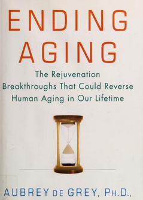
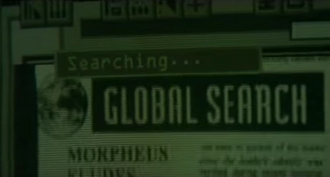

# Communication Breakdown > Lack of Data

### On the unique name assumption spectrum

NOTE: I am still working on this.

I was reading De Grey's "[Ending Aging](https://archive.org/details/endingagingrejuv00degr)" and I came across this:

> Researchers tend to get holed up in their narrowly specialized fields of study, and conse¬ quently they, too, rarely compare notes and observe the confluence of ob¬ servations in different fields of science (or even subfields within those fields) ... [facts are] being ob¬ scured by the use of specialist jargon ...

It stood out to me beacuse it is something I also encounter in my work with linked data / the semantic web / knowledge graphs.

## Quick Background

The context for that quote is that De Grey is describing how [lysosome](https://en.wikipedia.org/wiki/Lysosome) failure accounts for a range of diseases.

## Garbage Catastrophe theory of aging

Let's just let the book describe it:

> With his collaborator Alex Terman, Brunk outlined a “garbage catas¬ trophe” theory of aging, in which accumulating lipofuscin inside the lyso¬ some dilutes the organelle’s acidity and supply of enzymes. In this model, lipofuscin also wastes a lot of the enzymes that the cell body produces, by sucking them up without making effective use of them, thereby diverting them away from the other, still-functional lysosomal contents against which they could be put to effective use.

## Name #1

"lipofuscin"

> Lipofuscin is actually not a single, specific compound, but a catch-all term for the mixture of stubborn waste products that refuse to be broken down af¬ ter they’ve been sent to the lysosome for degradation—materials so chemically convoluted that the normal complement of lysosomal enzymes just doesn’t know how to deal with them.

Since De Grey was giving this theory a try he thought he should look for lipofuscin references in the scientific literature.

> But I wasn’t yet convinced that lysosomal failure was truly a significant contribu¬ tor to aging, because if the theory were right you would expect to find evi¬ dence connecting lipofuscin to actual age-related disease, and no such evidence initially turned up when I went looking for it.

> I quickly learned, however, that **this seeming lack of data was more of a communication breakdown than an information vacuum.** Researchers tend to get holed up in their narrowly specialized fields of study, and conse¬ quently they, too, rarely compare notes and observe the confluence of ob¬ servations in different fields of science (or even subfields within those fields). **I soon found that if I stopped specifically talking about “lipofuscin” and began asking researchers about the importance of lysosomal dysfunc¬ tion in the diseases that they studied, I was suddenly inundated with evi¬ dence that the accumulation of junk that should be processed in the lysosome was at the heart of the matter**—but that this fact was being ob¬ scured by the use of specialist jargon in referring to those wastes.

(emphasis mine)

## Name #2

"foam cells"

> As I quickly learned, researchers had been placing lysosomal failure at the core of the molecular events that underlie the formation of atherosclerotic plaques for years before I began looking into the issue—and they did so without ever mentioning “lipofuscin.”

## Name #3

"A2E" (when it pertains to Macular Degeneration)

> But again, because of the specialist terminology in use (A2E, rather than “lipofuscin”), the role of lysosomal inadequacy has been—and you will pardon the unfortunate pun!—obscured.

## TODO

NFT (neurofibrillary tangles) and Lewy Bodies are not lipofoscin. (see screenshot)
> people specifically looking for a connection with "lipofuscin" can miss these data...

## Wikipedia

So that's three distinct names...

I didn't look around for sources that were around in 2008 (when the book was published) but the Wikipedia page today for [Lipofuscin](https://en.wikipedia.org/wiki/Lipofuscin) does mention macular degeneration, A2E, and sclerotic arteries.

## Wikidata

Since De Grey notes the equivalence (or at least the connection) of these terms I wanted to see if connections were [machine-readably](https://en.wikipedia.org/wiki/Resource_Description_Framework) specified since they are human-readably specificed in the Wikipedia page on Lipofuscin. So I did a little SPARQL querying on Wikidata.

TODO add the triples

I found wd:Q217740
      "label": "Lipofuscin",
      schema.org description     pigment jaune brun
      a subclass of the class of chemical compounds
      hasPart carbon

and I found wd:Q27139841
      "description": "chemical compound",
        "text": "A2E"
        A2E is an altLabel, so is di-retinoid-pyridinium-ethanolamine
        label service calls it: N-retinylidene-N-retinylethanolamine

I did an iterative deepening search looking for a sequence of forward edges connecting Lipofuscin to A2E.
No results up to about 6 edges but then the queries started timing out.

Then I did an iterative deepening search looking for a sequence of forward edges connecting A2E to Lipofuscin.
No results up to about 6 edges but then the queries started timing out.

Notice that I didn't do an iterative deepening search looking for a sequence of forward and/or backward edges connecting A2E to Lipofuscin. That would be a good idea since not all edges in Wikidata have their entailed inverse.
e.g. 

this triple is in the Wikidata graph:

<http://www.wikidata.org/entity/Q175969> <http://www.wikidata.org/prop/direct/P551> <http://www.wikidata.org/entity/Q62> .

which says "Aubrey De Grey resides in San Francisco."

but this triple is not in the graph:

<http://www.wikidata.org/entity/Q62> <http://www.wikidata.org/prop/direct/P466> <http://www.wikidata.org/entity/Q175969> .

which says "San Francisco has resident Aubrey De Grey."  [1]

Also I found
"id": "Q38115664",
"label": "Foam cells in atherosclerosis.",
which is an instance of "scholarly article"
but I didn't try to look for connections.

There are people doing experiments and recording results with equipment I don't have access to and with techniques I do not know about. But I do know about graph query langauges and I like to integrate things. If those results were recorded using RDF (making using of existing ontologies and extending them when necessary) then it would allow people like me to integrate results across communication boundaries. 
"id": "Q50288904",
"label": "A2E is phagocytosed",

## What is the next step for me?

I've already spent a couple hours getting familar with Wikidata's [data model](https://www.mediawiki.org/wiki/Wikibase/Indexing/RDF_Dump_Format#Data_model) and vocabulary prefixes.
I'd like to figure out where and in what format I could make the machine-readable statements connecting A2E, lipofuscin, NLT, Lewy Bodies (perhaps with a few intermediate nodes) if they don't already exist somewhere...

## Background searching

Neo's search program, which continues while he is asleep, looks like it might have been a World Wide Web (one-way linked human-readable documents) search.

But a SPARQL (RDF) search would have been much more interesting. Jumping from service to service, traversing named graphs, finding ontologies, aligning them heursitically, and appling inference...

---

[1]  Which makes me think that it might be a good idea to see if there is an ontology that notes that wdt:P551 is owl:inverseOf wdt:P466 and for all the other cases. The <http://wikiba.se/ontology> ontology doesn't contain the `wdt:` properties.
