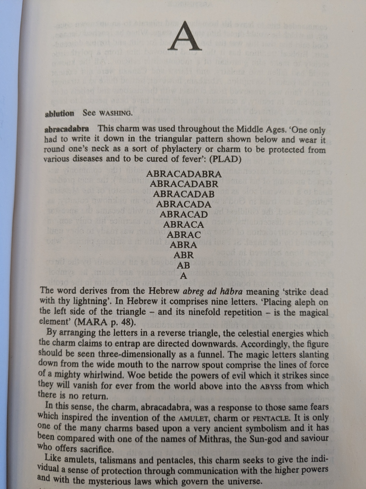
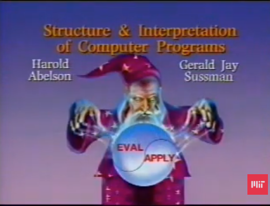

# ABRACADABRA

I like to use APL to express solutions to toy problems.
I was looking through books about signs and symbols the other day at the library and this page jumped out at me:



It was right after Halloween and Day of the Dead so I was primed for noticing things that seem grim or magical.

It is [tradition](https://www.youtube.com/watch?v=2Op3QLzMgSY) to think of source code writing as spell casting.



This textual representation of this magic funnel is just the sort of thing that is easy to conjure using APL.

```apl
      i←{⍺←' '⋄1↓,⍺,⍪⍵}        ⍝ Interpose
      up←{⊖(1+-⌽⍳≢⍵)⌽↑i¨,\⍵}   ⍝ Upsidedown Pyramid-ify
      up 'ABRACADABRA'
A B R A C A D A B R A
 A B R A C A D A B R 
  A B R A C A D A B  
   A B R A C A D A   
    A B R A C A D    
     A B R A C A     
      A B R A C      
       A B R A       
        A B R        
         A B         
          A  
```

You can use that to make your own charms [here](https://tryapl.org/).
Just paste the first three lines, one line at the time.

What other interesting variations can you come up with?
