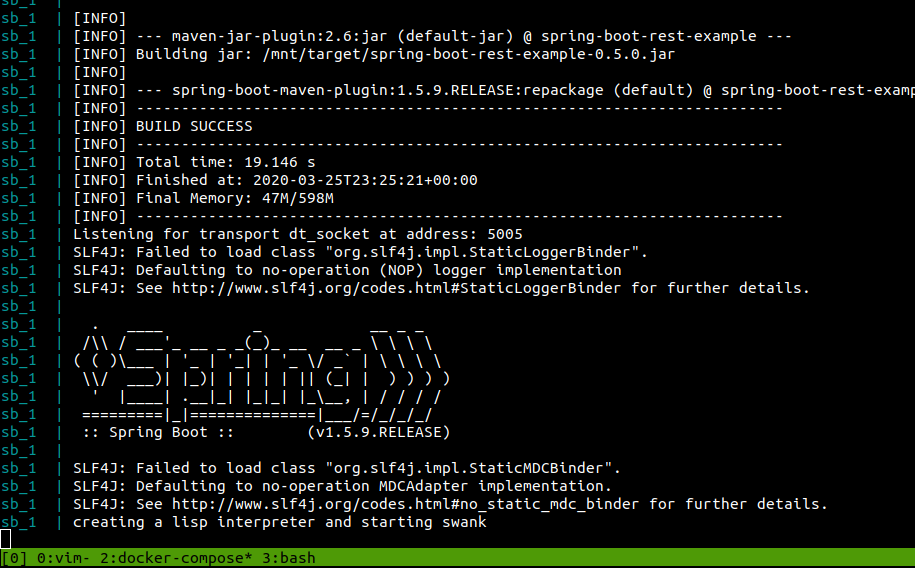
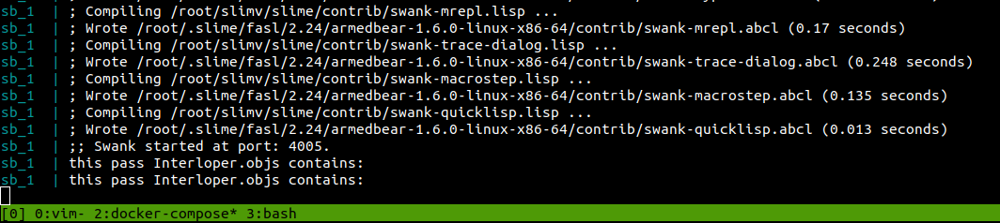
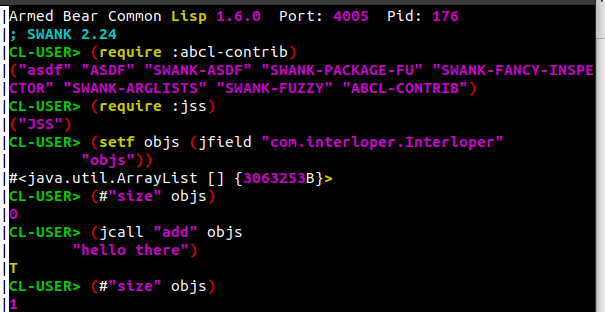
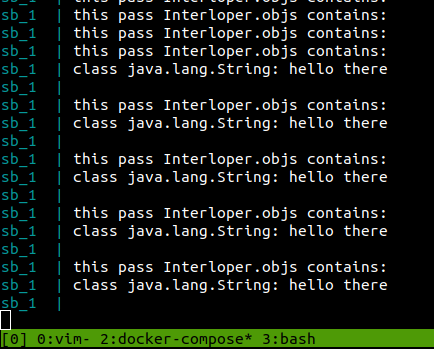

## Adding a Lisp Interpreter To a Spring Boot Application

ABCL ([Armed Bear Common Lisp](https://common-lisp.net/project/armedbear/)) is an implementation of Common Lisp that runs on the JVM. I really like the [REPL](https://en.wikipedia.org/wiki/Read%E2%80%93eval%E2%80%93print_loop) style development so I wanted to bring that to the Java application (using Spring Boot) I am working on.

This is nice because it allows one to explore a Java library without waiting on compilation and JVM startup.


### The first problem I encountered: the classloader

"The Spring Boot Maven and Gradle plugins both package our application as executable JARs – such a file can't be used in another project since class files are put into BOOT-INF/classes. This is not a bug, but a feature." [0](https://www.baeldung.com/spring-boot-dependency)


Once you are at the ABCL REPL you can look up classes like:
```
CL-USER> (jss:japropos "String")
...
sun.swing.StringUIClientPropertyKey: Java Class
sun.text.normalizer.ReplaceableString: Java Class
...
```


You can get a Java class designator like:
```
CL-USER> (jclass "java.lang.String")
#<java class java.lang.String>
```

Or you can just instantiate a new object:
```
CL-USER> (jss:new "java.lang.String"
         "hello there")
#<java.lang.String hello there {3F5F99BA}>
```


But if you've made your jar file using the Spring Boot Maven plugin you'll see something like:
```
CL-USER> (jss:japropos "Application")
BOOT-INF.classes.com.khoubyari.example.Application: Java Class
```

Which you can not get a designator for using the default classloader:
```
CL-USER> (jclass "BOOT-INF.classes.com.khoubyari.example.Application")
; Evaluation aborted on NIL
```

```
(jclass "com.khoubyari.example.Application")
Class not found: com.khoubyari.example.Application
   [Condition of type ERROR]
```


The default classloader won't load them.
I briefly tried to instantiate and use an "org.springframework.boot.loader.LaunchedURLClassLoader" (like Spring does) but I didn't get it to work (although in principle it should be possible, I think).

The way I got around this problem was to make a pom.xml with all the dependencies I want to be able to use from Lisp and from Java and then I put that resultant jar file on the classpath.

The key is to not start the application using the -jar flag but instead put all the jars on the classpath and then use flags to tell Spring Boot what the main class is:
```
CLASSPATH="target/spring-boot-rest-example-0.5.0.jar"
CLASSPATH="$CLASSPATH:/root/abcl-bin-1.6.0/abcl.jar"
CLASSPATH="$CLASSPATH:/mnt/shared-dependencies/target/shared-things-1.0.0-jar-with-dependencies.jar"

java -cp "$CLASSPATH" \
    -Dspring.profiles.active=test \
    -Dloader.main=com.khoubyari.example.Application \
    org.springframework.boot.loader.PropertiesLauncher
```

To demonstrate this I started with an existing Spring Boot application and on my [fork](https://github.com/justin2004/spring-boot-rest-example) (see the last few commits) I added a Lisp interpreted and loaded swank so I could explore and make changes to the live application.


If you have [docker](https://docs.docker.com/install/) and [docker-compose](https://docs.docker.com/compose/install/) installed you can: 


First, clone my [fork](https://github.com/justin2004/spring-boot-rest-example)


Next, run `docker-compose up`

Maven will build the jars then the JVM will be started:



In the main method a Lisp interpreter is created and it will read in a .lisp source file and start swank (the server side of [slime](https://common-lisp.net/project/slime/)):




Finally, use a slime client (here I use [slimv](https://github.com/kovisoft/slimv) also running in a docker [container](https://github.com/justin2004/slimv_box) to connect to the swank server running on the JVM in the docker container. (I won't describe how to connect a slime client here as I am using the abcl branch of my slimv_box repository which still requires some manual steps when building the docker image.)

Now you can type Lisp expressions in vim and they will be evaulated by the ABCL interpreter running in the remote JVM:



Above I got the reference to an ArrayList (a static field in the Interloper class), checked its size, added a string to it, then checked its size again. 



The Java code was able to see the change made by the Lisp interpreter.


### The next few problems I encountered include:
- The need to call methods on "java.lang.reflect.Field"
- Inner classes

I'll write about those in another installment.
Also I am keeping helper functions [here](https://github.com/justin2004/abcl_repl_helpers) as I write them.
