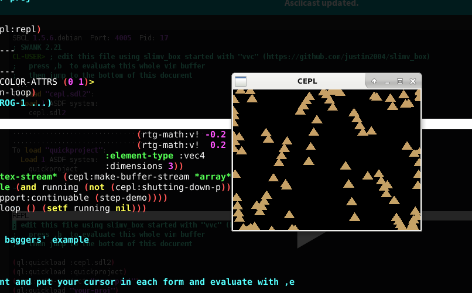

## CEPL 

CEPL is very cool project by baggers.

https://github.com/cbaggers/cepl

But I was having trouble getting the examples to run.

https://github.com/cbaggers/cepl.examples

I'm not sure if I just don't understand packages enough but I had to edit an example, adding some package qualifications, to get it to work.
So I thought i'd share what I used to get CEPL running in case someone else wants to try CEPL but is having trouble.

Baggers uses emacs so if you are an emacs user maybe it will be clear to you how to use CEPL by watching him use it:

https://www.youtube.com/channel/UCMV8p6Lb-bd6UZtTc_QD4zA

I'd say the following is mostly for vim users 

0) Get slimv_box from https://github.com/justin2004/slimv_box

0) Download a.lisp from this git repo

0) cd to the directory containing your downloaded a.lisp file

0) run `vvc` (see README at https://github.com/justin2004/slimv_box)

0) follow the instructions in a.lisp

