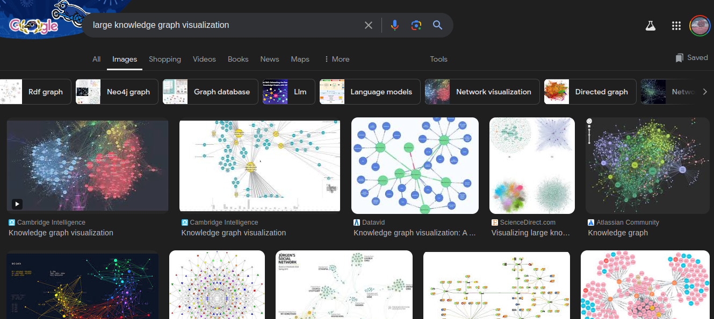
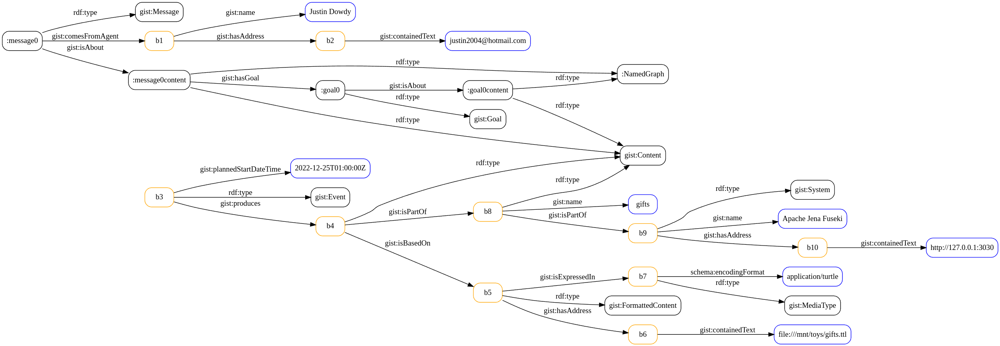
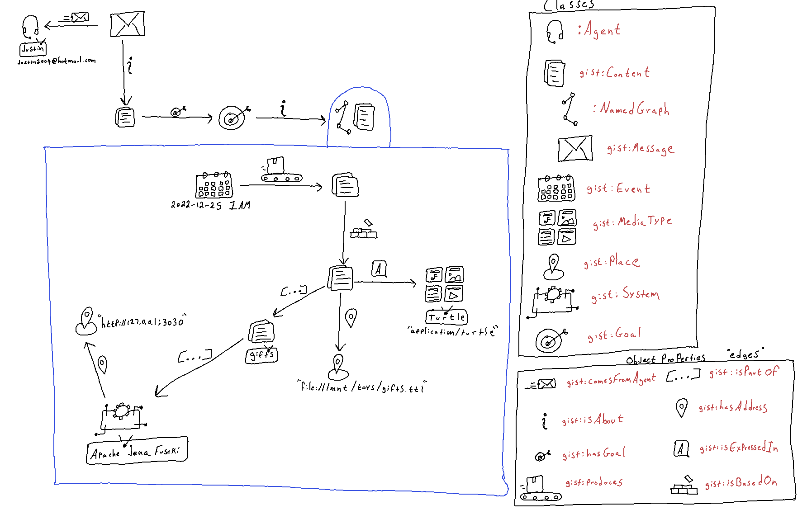

# Knowledge Graph Viz

## What We Currently Have

Knowledge Graph (KG) visualization is disappointing.
At least all the products I've used.

I think KG viz today is dissapointing because:

(1) they mostly using circles and lines

(2) the layout algorithms (radial, circular, force-directed, etc.) are unaware of what the edges and node types mean

(3) they don't have a way to downsample (when rendering a large graph) while preserving the spirit of the meaning of the data

Regarding (2), KG viz today doesn't make use of the information contained in the ontology used by the KG.
One of the reasons for this is because many KGs in the wild employ schemata but not ontologies (with primitives using axiomatic definitions). 
[gist](https://github.com/semanticarts/gist) is an example of such an ontology.

Unfortunately in the context of KGs, often when you hear people say "ontology" they merely mean "schema."

In KG viz today, when you get more 100 things to render they all look about the same:

<!--  -->

They look like abstract art.

I showed some of these to my seven year old son and he said "tons of random dots, what does that mean?"

When they are smaller (like a few dozen things) they might be more useful but you have to resort to reading them like text:

## What We Could Do Instead

I think what we are missing in KG viz are renderings that convey meaning intuitively.
Street signs with no words are a good example of this.
You don't need much experience in the world to have a pretty good idea of what they mean.
Also, the meaning is conveyed quickly -- you don't have to read text and engage a linguistic part of your mind.

I would like to see an option to render graphs more like this:

<!--  -->

One this to note about this approach is that there are only a few dozen concepts in the `gist` ontology that need to have associated icons (or visual motifs).
Imagine if a good designer took a pass at this.

This is just a first step.

This approach only involves iconic symbols for types of things and relationships between those things.
I show this to my son and he talked through what he thought it was representing and he got many of the ideas right.

I think subsequent rendering steps would involve making using of arrangement, orientation, proximity, and size. 

Orientation/direction:

For example, perhaps all the causal flavored edges in gist (`gist:triggers`, `gist:isAffectedBy`, `gist:produces`, etc.) could be rendered from left to right.
This would give the graph viz a causal left to right character that could help draw your eye to common causal dependencies.

Size:

For example, perhaps when the number of outgoing `gist:produces` edges gets larger the size of the source icon could get larger.

## Intuitive KG Viz Goals 

The main goal of these subsequence steps would be to allow a large portion of the graph to be rendered and downsample the resolution of the meaning (while maintaining the spirit of the meaning) so as to not produce a pixel overload that is incompressible.

An ideal KG viz should allow impressions (of the meaning of the graph) to be almost a reflex.

When you look out of the window from an airplane you don't see an incomprehensible pile of jiggling pixels.
Instead you see a downsampled scene of the world beneath you.
If you have enough altitude you can't see individual cars or buildings anymore, but you can recognize aggregations of them.

## Let's Do This

If you are a designer you could pick on ontology (maybe start with [gist](https://github.com/semanticarts/gist) or [CCO](https://github.com/CommonCoreOntology/CommonCoreOntologies)) and decide how to render each of the primitives (classes and object properties).

If you are a UI implementor perhaps you could implement my my simple design and then we could see how it scales up to larger graphs.

Let me know if you want to work on this together!
