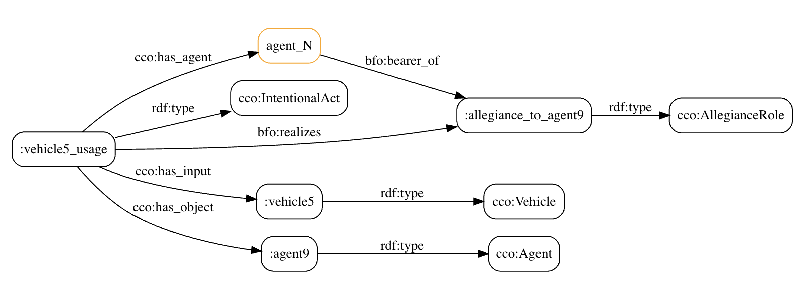
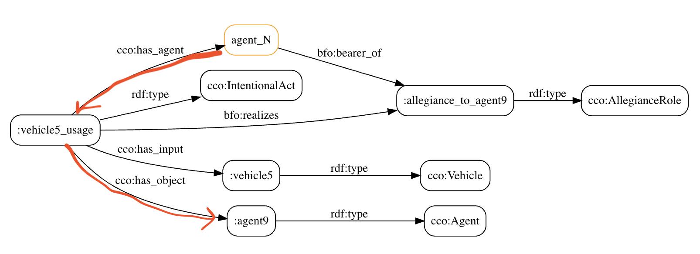

# Pulling Off the Bandaid

*Stop making query writers connect the dots*

Many people I've worked with on information systems understand that we, as an industry, lack semantic data interoperability.
Data emitted from one application is not understood by another application.
There are domain-specific data interchange formats but there isn't a widely adopted, domain-neutral, semantic data interchange scheme.
We know such a scheme would be quite useful and some organizations are investing in it.

Semantic Web ontologies are a great fit and they are getting used.
We've used them and RDF in every project I've worked on for the last several years.

The idea is that an ontology expresses a worldview and if you see your data through the eyes of that worldview then data will arrange itself in a way that permits query answering (between applications, databases, etc.).

Ontology teams are creating ontologies descended from [BFO](https://github.com/BFO-ontology/BFO)/[CCO](https://github.com/commoncoreontology/commoncoreontologies) for their problem domain.
BFO isn't the only upper ontology in the game but it has an ISO standard and I know it is being used.

So far so good.

However, here is what is not so good: [fused edges](https://github.com/justin2004/weblog/tree/master/fused_edges) aka "disconnected shortcut properties."

## The New Environment

It feels like we are entering something like a Cambrian explosion ("a sudden radiation of complex life") for software.
GenAI is making software easier to build. 
If RDF-based applications still require bespoke integration (custom mappings, etc.), their interoperability advantage becomes harder to demonstrate.

In order for symbolic AI to continue contributing in the data interoperability space, now would be a good time to pull off the "disconnected shortcut properties" bandaid.
It is preventing data interoperability in RDF-based applications.

If we don't pull it off, investment may shift toward alternatives with weaker semantic foundations.


## An Example

Say you want to express this situation as data within the BFO/CCO worldview:
"The usage of vehicle 5 is in allegiance with agent 9."
"Whoever is operating vehicle 5 is an ally of agent 9."

In a serialization of RDF called [Turtle](https://www.w3.org/TR/turtle/):

```turtle
:vehicle5_usage a cco:IntentionalAct ;
  bfo:realizes :allegiance_to_agent9 ;
  cco:has_input :vehicle5 ;
  cco:has_object :agent9 .

:agent9 a cco:Agent .
:vehicle5 a cco:Vehicle.
:allegiance_to_agent9 a cco:AllyRole .
:vehicle5_usage cco:has_agent _:agent_N .
_:agent_N bfo:bearer_of :allegiance_to_agent9 .
```

Here is that graph [expressed pictorially](https://semantechs.co.uk/turtle-editor-viewer/):



Nice.

I work on a system that works like that.
It makes inferences (with explanations) and is ready for data interoperability with other knowledge stores because it conforms with the spirit and letter of BFO/CCO.
We don't use shortcuts but if we did they'd be connected shortcuts.

## The Lack of Cooperation

Now, here is the move that prevents data interoperability.

Say I invent an object property `myontology:hasAllly` because I want to directly relate `_:agent_N` to `:agent9` like this:

```turtle
_:agent_N myontology:hasAlly :agent9 .
```

It is a disconnected shortcut if it is not defined by composing existing terms together.
Nearly every ontology team I've encountered that is creating ontologies under BFO/CCO is doing that.
It's a big deal.
A big bad deal.

## What it Causes

To see why it's a bad deal, let's load our data into a triplestore.

Can we run a query to find agents that are allies with another agent?
It's the kind of thing you'd like to find out about.

This finds my (fused edge) assertions:

```sparql
select * where {
?agentA myontology:hasAlly ?agentB .
}
```

This finds your (spirit and letter compliant) assertions:

```sparql
select * where {
?act a cco:IntentionalAct ;
     cco:has_agent ?agentA ;
     bfo:realizes ?allegiance ;
     cco:has_object ?agentB .
?allegiance a cco:AllyRole .
?agentA bfo:bearer_of ?allegiance .
}
```

This finds both of ours:
```sparql
select * where {
  {
    ?act a cco:IntentionalAct ;
         cco:has_agent ?agentA ;
         bfo:realizes ?allegiance ;
         cco:has_object ?agentB .
    ?allegiance a cco:AllyRole .
    ?agentA bfo:bearer_of ?allegiance .
  } UNION
  {
    ?agentA myontology:hasAlly ?agentB .
  }
}
```


If a team invents their own disconnected shortcut properties to directly relate two things, maintenance of this query gets more involved.
You'd need to add another UNION clause to your query.
This continues to push the integration work to query writers (which is where it's always been).

BFO and CCO were designed with a particular atomicity.
If you invent new terms that are defined without formal reference to existing terms then you are ignoring that atomicity.
And it is adherence to that atomicity that enables query answering across datasets (semantic interoperability).

A thoughtful ontology’s formal definitions already guide how its terms fit together.
Disconnected shortcut properties bypass that guidance and leave query writers to reconstruct the connections.

Imagine trying to define a Python function without referencing existing defined terms.
It won't do anything useful.
Human readable comments won't help it be useful.

```bash
cat a.py
```

```python
def assert_allegiance(a,b):
    pass

assert_allegiance('agent1','agent2')
```

```bash
$ python ./a.py
# nothing happens
```

That is what these disconnected shortcut properties are doing: *nothing* for data interoperability.


## Possible Reasons

Why are ontologists doing this?

I listed some of the reasons [here](https://github.com/justin2004/weblog/tree/master/fused_edges#why) when I wrote about fused edges.
I speculate on the cause so that perhaps it could be addressed at the root.

It should be a huge red flag when the ontology yours descends from has `:AllyRole` as a class and you invent the object property `:hasAlly` without formally referencing that class.

I suspect teams sometimes treat a finished ontology file as a finished interoperability solution.
The missing test is whether independently produced data can answer shared queries.


## Wrapping Up

There is still a place for symbolic AI (like the Semantic Web tech stack, logic languages, formal reasoners) in information systems.
While statistical AI is serving up lots of useful text we still want a lingua franca between black-box models that generate that text and people.

The longer I work in this field the more value I place on finding the worldview that allows you to iterate with virtuosity and joy in your problem space.

Ontologies are worldviews.
Programming paradigms and languages are worldviews.

One of my colleagues said that BFO (and therefore ontologies descended from it) is untenable.
I see work taking place now that will eventually find out if that is true.
If ontologists can't or won't use it at its specified level of atomicity then how do we expect others to?
I think BFO is an interesting worldview with a decent amount of momentum.
It would be nice if ontologists would have sufficient discipline to use it atomistically to give it a good chance of being useful.

To data producers:
If, for any reason, you have to invent a notation to describe expressions written in language X then worry if language X is the wrong language for you.

To product managers overseeing ontology-related work:
Require ontology teams to demonstrate shared competency queries across independently produced datasets. 
The more teams that participate, the better.


---

## Notes

#### composition

Here is one way to partially connect `myontology:hasAlly` to existing terms:

```turtle
myontology:hasAlly a owl:ObjectProperty ;
  rdfs:subPropertyOf [ owl:propertyChainAxiom ( cco:agent_in cco:has_object ) ] .
```

This connects the shortcut and the displayed path through a shared superproperty:



Though this is a little underspecified because it leaves out the detail that the thing in the middle should `bfo:realizes` an instance of a `cco:AllyRole`.

#### IRIs

Also, I'm using BFO labels as the IRI for readability.
CCO 1.7 was the last version of CCO to use human-readable IRIs.
BFO uses opaque IRIs and now CCO does and it is not helpful for RDF adoption.
