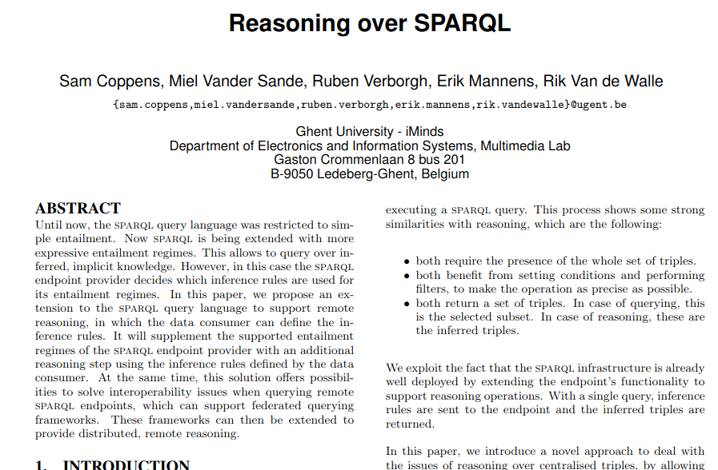

# Reasoning over Wikidata


## Wouldn't it be nice

I posted [this question](https://www.reddit.com/r/semanticweb/comments/lp0iey/reasoning_over_service/) a few days ago. The idea is that it would be nice to be able to query a remote SPARQL endpoint and specify an ontology to be used with a reasoner over the triples from the remote endpoint. For example I know that in this ontology that I bring I would like this triple:

`wdt:P31 rdfs:subPropertyOf rdf:type .`

wdt:P31 is Wikidata's way of saying "is an instance of" and that is what rdf:type says too.


I naively thought this just might work if I query a triplestore that has reasoning enabled and I specify a service to get some triples from [Wikidata](https://www.wikidata.org).

```
 select * where { 
     service <https://query.wikidata.org/sparql> {
         ?s ?p ?o .
         filter(?s=wd:Q23) .
         filter(?o=wd:Q5) .
     }
```


But I couldn't get the local triplestore to reason over the triples that satisfy my service clause.


A little searching led me to [this](http://ceur-ws.org/Vol-996/papers/ldow2013-paper-08.pdf) academic paper.



It looked promising.

> ... the sparql endpoint provider decides which inference rules are used for its entailment regimes. In this paper, we propose an extension to the sparql query language to support remote reasoning, in which the data consumer can define the inference rules.

I was excited.

But I was reminded that, often, engineers can't easily spend academic currency.
Publishing a paper (or attempting to) and proposing a standard (or an extension to a standard) might win academic points but it doesn't help me leverage Wikidata today.

> For the proof-of-concept, we have extended Apache Jena ARQ query engine to support remote reasoning

The paper mentions but does not make code available.


I think saying that [The Scientific Paper Is Obsolete](https://www.theatlantic.com/science/archive/2018/04/the-scientific-paper-is-obsolete/556676/) sounds harsh but I would have much prefered a "computational essay" that actually executes and produces some result than a paper whose writers would like to get a [standard](https://www.w3.org/TR/sparql11-query/) extended.

Side note:

Someone in academia might think "proposed an extension to a standard" looks good on a CV but wouldn't "wrote a tool that became the cURL of remote-ish SPARQL reasoning" look better?
I don't even need to link to cURL. You know what it is and how useful it is.

## Make something that works today

I had recently read Ritchie and Thompson's "The UNIX Time-Shaing System" [paper](https://archive.org/details/UNIX-Time-Sharing-System) from 1974. 
Their software composability ideas where mingling with my desire to have reasoning over remote SPARQL endpoints.

> The most important role of UNIX is to provide a file system.

That is partly because files are a great way to allow interprocess communication to be blended with human interaction.

I got excited again thinking that I could implement something like remote reasoning using UNIX thinking a.k.a [Small, Sharp tools](https://www.brandur.org/small-sharp-tools).

> 6.2 Filters

> ...

> A sequence of commands separated by vertical bars causes the Shell to execute all the commands simultaneously and to arrange that the standard output of each command be delivered to the standard input of the next command in the sequence.

The sequence I had in mind goes like this:

0) Find or craft some triples to serve as your [Tbox](https://en.wikipedia.org/wiki/Tbox) (ontology) triples.

0) Query the remote SPARQL endpoint to obtain some triples that you want to reason over.

0) Apply a reasoner (using your Tbox triples) to the triples you want to reason over and produce some additional derived triples.

0) Run a final SPARQL query against all the resultant (derived and original) triples.


## The result

The project I made ended up [here](https://github.com/justin2004/wikidata_reasoning).

It presents the illusion of remote reasoning (since reasoning actually happens locally) but it does not require any standard extension -- it simply glues together existing tools and uses existing standards.
It also doesn't tease someone will a desire to reason over a remote SPARQL endpoint. It runs and produces results.

I could have made this repo a single command pipeline but the Apache Jena command line utilities sometimes need to see a file (with an extension) so it can guess what RDF serialization format is in use. 
But it is also nice to store intermediate results in files because then you can change queries or the ontology file and let `make` decide what needs to be executed to update your output file. 


See the [project page](https://github.com/justin2004/wikidata_reasoning) for a demonstration.
