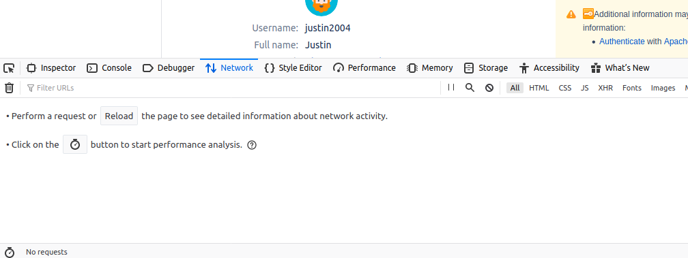
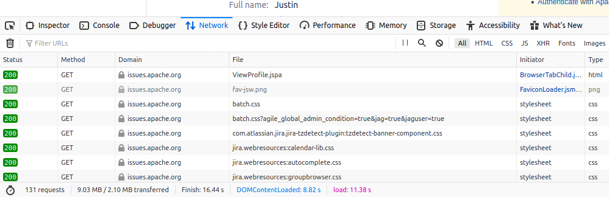
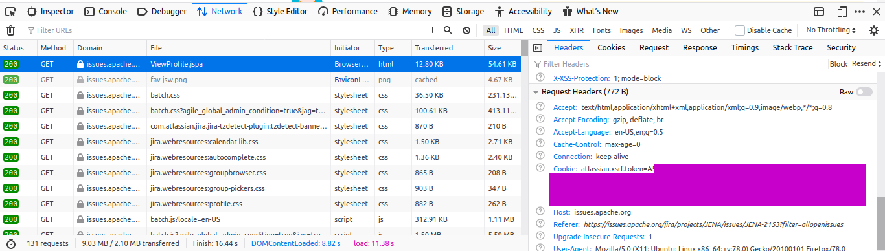
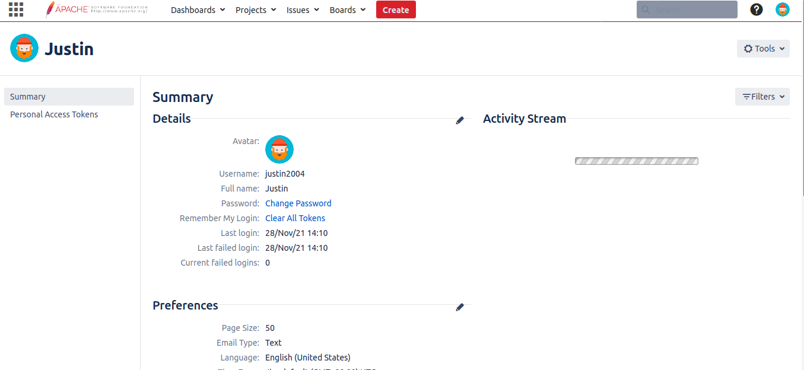
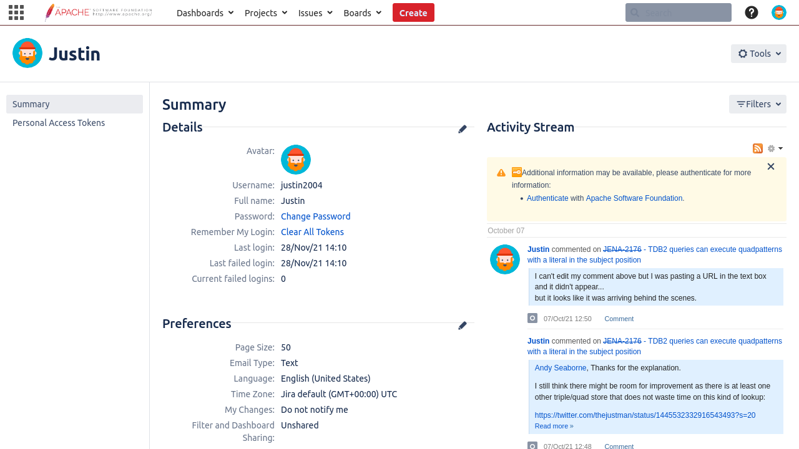

# Scraping Webpages with SPARQL

## Intro

Sometimes you want some data that does not sit behind an application friendly API.
The friendliest API is a SPARQL endpoint.
Using [SPARQL Anything](https://github.com/SPARQL-Anything/sparql.anything) you can view many APIs as approximations of SPARQL endpoints.
You can even view webpages as approximations of SPARQL endpoints.

In this post I am going to be [scraping](https://en.wikipedia.org/wiki/Web_scraping) some data from Apache's JIRA.
I created an issue for Apache Jena a while back and I am going to pretend I want to be reminded of my activity on that issue.
Let's also pretend that Apache's JIRA doesn't have a more friendly REST API (because sometimes even if one exists you may not have access to use it.).

[This](https://issues.apache.org/jira/secure/ViewProfile.jspa) is the URL we'll be scraping.
It is my user profile.

Things to note:

- You have to be logged into this page to see your activity stream
- To see your activity stream you need javascript to interpret the webpage
- Web Browsers (I am using Firefox) emit events as pages load
    - ["The DOMContentLoaded event fires when the initial HTML document has been completely loaded and parsed, without waiting for stylesheets, images, and subframes to finish loading."](https://developer.mozilla.org/en-US/docs/Web/API/Window/DOMContentLoaded_event)
    - ["A different event, load, should be used only to detect a fully-loaded page."](https://developer.mozilla.org/en-US/docs/Web/API/Window/DOMContentLoaded_event)
- Sometimes content is still loading into a webpage even after the "load" event fires so you might need to be able to wait to scrape the content you want

SPARQL Anything can handle all of that with your assistance.

I'll break the process down a little bit (assuming you've never scraped a webpage before).

## Login

We are just going to do the cheap approach: manually login with our browser then manually get the [cookie](https://en.wikipedia.org/wiki/HTTP_cookie).

Log in with your credentials and navigate to the page you want to scrape.

---

Open your Inspector and go to the Network tab.


---

Refresh the page, in the Inspector scroll up the to first request and click it.


---

In the headers tab you should see Request Headers (I've obscured my cookie value).


---

Usually Request Headers have all the information you need to send to the website in order to scrape.
Copy information into your SPARQL query as needed.
It often requires some experimentation to figure out the minimum set of headers you actually need.

## Write a hello world SPARQL (construct) query to see if it works

I've got SPARQL Anything running in its Docker container.
The SPARQL query is wrapped in a bash command:

```sparql
curl --silent 'http://localhost:3000/sparql.anything'  \
--data-urlencode 'query=
PREFIX xyz: <http://sparql.xyz/facade-x/data/>
PREFIX ns: <http://sparql.xyz/facade-x/ns/>
PREFIX rdf: <http://www.w3.org/1999/02/22-rdf-syntax-ns#>
PREFIX fx: <http://sparql.xyz/facade-x/ns/>
prefix skos: <http://www.w3.org/2004/02/skos/core#>
prefix what: <https://html.spec.whatwg.org/#>
prefix xhtml: <http://www.w3.org/1999/xhtml#> 
prefix ex: <http://www.example.com/>
PREFIX xsd: <http://www.w3.org/2001/XMLSchema#>
construct {?s ?p ?o}           
WHERE {                          
service <x-sparql-anything:> {                     
fx:properties fx:location "https://issues.apache.org/jira/secure/ViewProfile.jspa" .
fx:properties fx:media-type "text/html" .        
fx:properties fx:html.browser "firefox" .
fx:properties fx:html.browser.screenshot "file:///app/screenie.png" .
fx:properties fx:html.browser.wait "5" .
fx:properties fx:http.header.User-Agent "Mozilla/5.0 (X11; Ubuntu; Linux x86_64; rv:78.0) Gecko/20100101 Firefox/78.0" .
fx:properties fx:http.header.Cookie "atlassian.xsrf.token=BLAHBLAH..." .
?s ?p ?o .
}
}'
```

Which yields triples (in turtle format):
```turtle
@prefix ex:    <http://www.example.com/> .
@prefix fx:    <http://sparql.xyz/facade-x/ns/> .
@prefix ns:    <http://sparql.xyz/facade-x/ns/> .
@prefix rdf:   <http://www.w3.org/1999/02/22-rdf-syntax-ns#> .
@prefix skos:  <http://www.w3.org/2004/02/skos/core#> .
@prefix what:  <https://html.spec.whatwg.org/#> .
@prefix xhtml: <http://www.w3.org/1999/xhtml#> .
@prefix xsd:   <http://www.w3.org/2001/XMLSchema#> .
@prefix xyz:   <http://sparql.xyz/facade-x/data/> .

[ rdf:type                     xhtml:html , ns:root ;
  rdf:_1                       [ rdf:type        xhtml:head ;
                                 rdf:_1          [ rdf:type       xhtml:meta ;
                                                   xhtml:charset  "utf-8"
                                                 ] ;
...
```

You'll notice in my query that I said:

The URL is:

`fx:properties fx:location "https://issues.apache.org/jira/secure/ViewProfile.jspa" .`

Expect html content:

`fx:properties fx:media-type "text/html" .`        

Use a headless browser (firefox):

`fx:properties fx:html.browser "firefox" .`

Take a screenshot (in case we need to troubleshoot) and save it here:

`fx:properties fx:html.browser.screenshot "file:///app/screenie.png" .`

After the "load" event is emitted wait 5 seconds:

`fx:properties fx:html.browser.wait "5" .`

Send the following two HTTP headers (that we copied from the Inspector earlier):

```
fx:properties fx:http.header.User-Agent "Mozilla/5.0 (X11; Ubuntu; Linux x86_64; rv:78.0) Gecko/20100101 Firefox/78.0" .
fx:properties fx:http.header.Cookie "atlassian.xsrf.token=BLAHBLAH..." .
```

---

In this case, if you don't wait a few seconds your content won't be loaded:



---

When you do wait a few seconds you get (as seen in file:///app/screenie.png):



---

## Pick the HTML elements you need

Let's just pretend I need a few details of my activity.

After some exploration of the triples I arrive at the following query:

```sparql
curl --silent 'http://localhost:3000/sparql.anything'  \
-H 'Accept: text/csv' \
--data-urlencode 'query=
PREFIX xyz: <http://sparql.xyz/facade-x/data/>
PREFIX ns: <http://sparql.xyz/facade-x/ns/>
PREFIX rdf: <http://www.w3.org/1999/02/22-rdf-syntax-ns#>
PREFIX fx: <http://sparql.xyz/facade-x/ns/>
prefix skos: <http://www.w3.org/2004/02/skos/core#>
prefix what: <https://html.spec.whatwg.org/#>
prefix xhtml: <http://www.w3.org/1999/xhtml#> 
prefix ex: <http://www.example.com/>
PREFIX xsd: <http://www.w3.org/2001/XMLSchema#>
select ?username ?action_string ?issue_string ?issue_label ?issue_type ?when_string
WHERE {
service <x-sparql-anything:> {
fx:properties fx:location "https://issues.apache.org/jira/secure/ViewProfile.jspa" .
fx:properties fx:media-type "text/html" .
fx:properties fx:html.browser "firefox" .
fx:properties fx:html.browser.screenshot "file:///app/screenie.png" .
fx:properties fx:html.browser.wait "5" .
fx:properties fx:http.header.User-Agent "Mozilla/5.0 (X11; Ubuntu; Linux x86_64; rv:78.0) Gecko/20100101 Firefox/78.0" .
fx:properties fx:http.header.Cookie "atlassian.xsrf.token=BLAH" .
[ ?slotA [ ?slot1 [ xhtml:class "activity-item-user activity-item-author" ;
                          what:innerText ?username ] ;
           ?slot2 ?action_string ;
           ?slot3 [ rdf:_1 [ rdf:_1 ?issue_string ] ;
                             what:innerText ?issue_label ] ] ;
  ?slotB [ rdf:_1 [ xhtml:alt ?issue_type ] ;
                    rdf:_2 [ rdf:_1 ?when_string ] ] ]
filter(fx:next(?slot1) = ?slot2)
filter(fx:next(?slot2) = ?slot3)
filter(fx:next(?slotA) = ?slotB)
}
}'
```

Which yields:

|username  |action\_string      |issue\_string |issue\_label        |issue\_type |when\_string     |
|----------|--------------------|--------------|--------------------|------------|-----------------|
|Justin    |created             |JENA\-2176    |JENA\-2176 \- TDB2 queries can execute quadpatterns with a literal in the subject position JENA\-2176|Question    |05/Oct/21 00:49  |
|Justin    |updated the Description of |JENA\-2176    |JENA\-2176 \- TDB2 queries can execute quadpatterns with a literal in the subject position JENA\-2176|Question    |05/Oct/21 23:33  |
|Justin    |updated the Description of |JENA\-2176    |JENA\-2176 \- TDB2 queries can execute quadpatterns with a literal in the subject position JENA\-2176|Question    |05/Oct/21 00:53  |
|Justin    |updated the Description of |JENA\-2176    |JENA\-2176 \- TDB2 queries can execute quadpatterns with a literal in the subject position JENA\-2176|Question    |05/Oct/21 00:52  |
|Justin    |attached 2 files to |JENA\-2176    |JENA\-2176 \- TDB2 queries can execute quadpatterns with a literal in the subject position JENA\-2176|Question    |05/Oct/21 00:54  |
|Justin    |commented on        |JENA\-2176    |JENA\-2176 \- TDB2 queries can execute quadpatterns with a literal in the subject position JENA\-2176|Question    |05/Oct/21 13:14  |
|Justin    |commented on        |JENA\-2176    |JENA\-2176 \- TDB2 queries can execute quadpatterns with a literal in the subject position JENA\-2176|Question    |07/Oct/21 12:48  |
|Justin    |commented on        |JENA\-2176    |JENA\-2176 \- TDB2 queries can execute quadpatterns with a literal in the subject position JENA\-2176|Question    |07/Oct/21 12:50  |


Also note that I requested `text/csv` but you can request the data in a different format:

`text/tab-separated-values`

`application/sparql-results+xml`

`application/sparql-results+json`


## Comments on writing the query

To write a query against triplified HTML it is pretty much essential to have the raw triples (from the hello world query above) open in an editor for reference.

I use folding (in my editor) to focus on the nodes of interest.

This part of the query (triple patterns and filters) does all the extraction:
```
[ ?slotA [ ?slot1 [ xhtml:class "activity-item-user activity-item-author" ;
                          what:innerText ?username ] ;
           ?slot2 ?action_string ;
           ?slot3 [ rdf:_1 [ rdf:_1 ?issue_string ] ;
                             what:innerText ?issue_label ] ] ;
  ?slotB [ rdf:_1 [ xhtml:alt ?issue_type ] ;
                    rdf:_2 [ rdf:_1 ?when_string ] ] ]
filter(fx:next(?slot1) = ?slot2)
filter(fx:next(?slot2) = ?slot3)
filter(fx:next(?slotA) = ?slotB)
```

It is vanilla SPARQL but with a function that is defined in SPARQL Anything: `fx:next()` which is described [here](https://github.com/SPARQL-Anything/sparql.anything#magic-properties-and-functions).

I find that the part that takes the most time is making the extraction triple patterns.
One thing that I think would help a lot would be a plugin for my text editor to show the path from the root node to the node my cursor is currently in.


## Closing

Why would you want to use SPARQL to scrape a webpage?

Of course you can scrape webpages (that render content with javascript) with general purpose languages using libraries like [Puppeteer](https://github.com/puppeteer/puppeteer/) or [Playwright](https://github.com/microsoft/playwright-java) (which is what SPARQL Anything uses under the hood).

What I like about this approach is that SPARQL is the only language that everyone on my team knows very well.
We already implement non-RDF to RDF transformations using SPARQL constructs and deliver answers to questions using SPARQL.

Also I think it would be easier to teach a non-programmer to scrape using this method.
Plus it would greatly benefit many non-programmers to learn some SPARQL and start querying [Wikidata](https://www.wikidata.org).
I recommend [this tutorial](https://www.youtube.com/watch?v=kJph4q0Im98) on SPARQL querying Wikidata.

One thing I did not demonstrate in this post is the ability to, in this single SPARQL query, integrate with:
- SPARQL endpoints
- most REST APIs
    - including other webpages
- files in your filesystem

So you could scrape from this page, iterate over referenced webpages (scraping them), bind some strings from the referenced webpages, then do a lookup of those strings using a REST API, then do a final lookup using a SPARQL endpoint.
If you are interested in such a thing I have a [blog post](/blend_google_sheet_with_wikidata) on using SPARQL Anything to blend a Google Sheet with Wikidata.

In general, I think using SPARQL/RDF encourages you to lay your data down such that it wears its meaning on its sleeve (because you can't as [easily](/SPARQL_value_functions) specify arbitrary processes in SPARQL).
By "wear its meaning on its sleeve I mean": data that doesn't require each query to express an unpacking process and data that uses a common vocabulary/ontology across domains.

Example of unpacking:

If you store a range like "32-45" then each query will need to apply some regex or some function to enumerate the integers in the range if it needs to match a single integer.

Example of using a common vocabulary/ontology:

If you have a relational database with the tables "Customer" and "Supplier" and each have a column "name" (or a reference to a column that eventually leads to a column called "name") those have the same meaning (casual name) but you can't use the same predicate to obtain the names.
If you have to write a query that uses "Customer.name" and "Supplier.name" curiosity won't lead you to write a query that uses "Customer.name," "Supplier.name," "TruckDriver.name," "Mechanic.name," "Administrator.name," etc. but curiosity will lead you to a query like "?s [gist:name](https://github.com/semanticarts/gist/blob/develop/gistCore.ttl#L3757) ?name" that will look for any subject that has a casual name.

Ok, have fun scraping with SPARQL!


NOTE: If you are seeing this and you want to follow my example (or do some scraping of a webpage of your own) then you'll need to use [my fork of SPARQL Anything](https://github.com/justin2004/sparql.anything/tree/iframes).
I'll delete this note once my pull request goes into the upstream repository.
