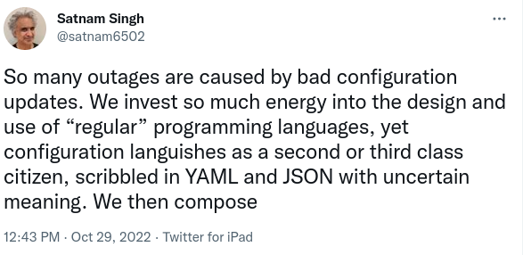

# Interfaces and Interactions

## Too Much Specificity And Not Enough Play

I recently saw [this](https://twitter.com/satnam6502/status/1586398234326446080?s=20&t=mWqKsR_2LdG5WeHE37y5Ow) tweet and it reminded me about something I've wanted to think and talk about.



Satnam continues

> configuration management has not had the attention enjoyed by academic research for languages and networking, as well as language and networking innovations in industry.

> I don’t think a “configuration language” is the solution, nor is a domain specific language / library (DSL).

I tend to agree.
I think perhaps we should explore more loosey-goosey, declarative approaches.
That is, I'd like to explore systems with more play (as in "scope or freedom to act or operate").

I'd like to see more semantic messages that convey the spirit rather than the letter.
When you can't foresee all the consequences of the letter then that's when the spirit can help.

That's what I'd like to think about in this post.

Let's see an example of such a loosey-goosey semantic message.

## Semantic Messages

I'm writing another blog post on what "semantic" means in the semantic web.
I'll put a link here once I am done but in the mean time think of "semantic" as getting different things (different people, different machines, people and machines, etc.) to see eye to eye.
Yes, a tall order, but I'm optimistic about it.

The hypothetical situation is that I have an instance of Apache Jena Fuseki (a database for RDF) running on my local machine.
There is a software agent (semantic web style) running on my local machine that knows how to interact with Apache Jena Fuseki.
I am running a software agent (semantic web style) to whom I make requests.

I have a file on my machine that I want to load into a dataset on the Apache Jena Fuseki instance.
I type this request to my agent "load /mnt/toys/gifts.ttl into Apache Jena Fuseki listening on port 3030 at dataset 'gifts' on 25 Dec early in the morning."

My agent produces the following RDF (or I do by some other means) in TriG serialization:

```turtle
@prefix : <https://example.com/> .
@prefix gist: <https://ontologies.semanticarts.com/gist/> .
@prefix owl: <http://www.w3.org/2002/07/owl#> .
@prefix rdf: <http://www.w3.org/1999/02/22-rdf-syntax-ns#> .
@prefix rdfs: <http://www.w3.org/2000/01/rdf-schema#> .
@prefix skos: <http://www.w3.org/2004/02/skos/core#> .
@prefix xml: <http://www.w3.org/XML/1998/namespace> .
@prefix xsd: <http://www.w3.org/2001/XMLSchema#> .
@prefix schema: <http://schema.org/> .

:message0 a gist:Message ;
  gist:comesFromAgent [ gist:name "Justin Dowdy" ;
                        gist:hasAddress [ gist:containedText "justin2004@hotmail.com" ] ] ;
  gist:isAbout :message0content .

:message0content a gist:Content, :NamedGraph ;
  rdfs:comment "this named graph is the content of the message" .

:message0content {
    :message0content gist:hasGoal :goal0 .
  :goal0 a gist:Goal ;
    rdfs:comment "this is the goal specified in the content of the message" ;
    gist:isAbout :goal0content .
}

:goal0content a gist:Content , :NamedGraph ;
  rdfs:comment "this named graph is the content of the goal" .

:goal0content {
  [ a gist:Event ;
    gist:produces [ a gist:Content ;
                    gist:isBasedOn [ a gist:FormattedContent ;
                                     gist:hasAddress [ gist:containedText "file:///mnt/toys/gifts.ttl" ] ;
                                     gist:isExpressedIn [ a gist:MediaType ;
                                                          schema:encodingFormat "application/turtle" ] ] ;
                    gist:isPartOf [ a gist:Content ;
                                    gist:name "gifts" ;
                                    rdfs:comment 'the dataset called "gifts"' ;
                                    gist:isPartOf [ a gist:System ;
                                                    gist:hasAddress [ gist:containedText "http://127.0.0.1:3030" ] ;
                                                    gist:name "Apache Jena Fuseki" ] ] ] ;
   gist:plannedStartDateTime "2022-12-25T01:00:00Z"^^xsd:dateTime ]
}
```

### Side Note

You might notice that I've used the URI of an RDF named graph in the place where a resource would typically be expected.
With this blog post I am also thinking about using named graphs to represent the content of goals (`gist:Goal`).
Really a named graph could represent the content of many different types of things.

<!-- RDF-star is designed to allow one to treat a single triple as a resource that you can refer to but I think RDF named graphs already allow that and they allow the more general case of referencing multiple triples. -->
<!-- So far I think RDF-star is, at best, too low level and at worst it encourages domain modeling that is based on annotating statements rather than expressing things and relationships in the world. -->


## Back to the semantic message example

My agent then puts that RDF onto the semantic message bus (the bus where agents listen for and send RDF) on my local machine.
The agent that governs Apache Jena Fuseki sees the RDF and recognizes that it knows how to handle the request.

The Fuseki agent that interprets that RDF needs to know some things.

The Fuseki agent needs to know things like:
- that it is capable of and allowed to handle requests to load data into the Apache Jena Fuseki running on localhost at port 3030
- how to use [GSP](https://www.w3.org/TR/sparql11-http-rdf-update/) or some other programmatic method to load data into Fuseki
  - how to reference a dataset or optionally create one if the desired on does not exist
- how to delay the execution of this (since the `gist:plannedStartDateTime` is in the future)

My agent needs to know things like:
- it is allowed to make assumptions 
  - e.g. if I leave off the year, when I am talking about a goal, when I reference a date then I probably mean whatever year that date occurs in next
- it can look in my existing graphs (perhaps my "personal knowledge graphs") to gather information

Fuseki's agent can't be too finicky about interpreting the RDF.
The RDF isn't really a request conforming to a contract; it is more of a spirit of a request.

If you are familiar with RDF and [gist](https://github.com/semanticarts/gist), the spirit of the RDF is pretty clear "early in the morning on December 25th find the file /mnt/toys/gifts.ttl and load it into the dataset 'gifts' on the Apache Jena Fuseki server running on localhost at port 3030."

If the agent saw this message or a similar message but it knew the message content wasn't sufficient for it to do anything then it would reply, by putting RDF onto the semantic message bus, with the content of another goal as if to say "did you mean this?"
There could be a back and forth between my agent and the agent governing Apache Jena Fuseki as my agent figures out how to schedule the ingestion of that data.

But this time Fuseki's agent knew what to do.
It runs the following command:

```bash
at 25 dec 1am <<~
curl -X POST 'http://127.0.0.1:3030/gifts/data' -H 'Content-type: text/turtle' --data-binary @/mnt/toys/gifts.ttl
~
```

My agent receives some confirmation RDF and the gifts should be available, via SPARQL, before the kids wake up on Christmas morning.

## The Article

In this post I'm mostly sketching out some of the consequences of the ideas presented in [this](https://www-sop.inria.fr/acacia/cours/essi2006/Scientific%20American_%20Feature%20Article_%20The%20Semantic%20Web_%20May%202001.pdf) 2001 Scientific American article.

> Standardization can only go so far, because we can't anticipate all possible future needs.

Right on.

> The Semantic Web, in contrast, is more flexible. The consumer and producer agents can reach a shared understanding by exchanging ontologies, which provide the vocabulary needed for discussion. 

I'm less optimistic that we'll sort out useful ontology exchange anytime soon.
In the mean time I think picking a single upper ontology that is squishy in the right ways is a path forward.

> Semantics also makes it easier to take advantage of a service that only partially matches a request.

I think for semantics to work in this way we have to accept that our systems will get more adaptive at the cost of becoming less brittle.

Brittle: 
- by design, shouldn't ever be wrong
- when it sees something unexpected it stops or breaks

Adaptive: 
- by design, could be wrong
- when it sees something unexpected it tries to figure it out

That might be hard for people to accept.
Perhaps it is why we haven't progressed much on these kind of agents since the 2001 article.


## Closing

I haven't sketched everything out.
For example, what if the command fails on 25 Dec because the file is missing?
I'd expect the Fuseki agent to tell my agent.
Also maybe my agent could periodically check that the file is accessible and report back to me if it isn't.

Anyway, I imagine you get the idea.

I do think a requirement of semantic message buses is that all agents must have the same world view and speak the same language.
Ontologies set the world view and language.
I used the [gist upper ontology](https://github.com/semanticarts/gist) for my example.

Maybe make an agent!
Or let me know what you think about this stuff.
