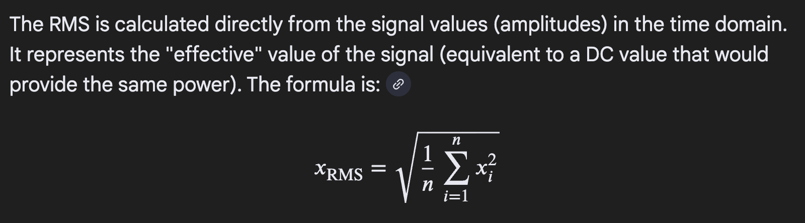

# Train Trees


## Motivation

Near the end of [ArrayCast episode 121](https://www.youtube.com/watch?v=lBrczam-Dvk) there was a desire for feedback about binding strength of tacit expressions in APL.

It was noted that sometimes it is hard "to see how far things reach."
Operators have long left scope and functions have long right scope and perhaps the long left scope is less intuitive.

In Dyalog APL, I find that looking at train trees is more than sufficient for getting binding strength and train syntax feedback.

They are enabled with:

```
]box on -trains=tree
```

I don't see the need for any other binding strength visual feedback system as I hope to demonstrate below.

## Example

Recently I needed to write a Root Mean Square function.
I am using that function on a vector of PCM audio samples.




I first wrote the RMS function like this:

```apl
*∘0.5⍤(+/*∘2÷≢)
```

Which has this corresponding train tree

```apl
     ⍤
 ┌───┴────┐
 ∘      ┌─┴─┐
┌┴┐     / ┌─┼─┐
* 0.5 ┌─┘ ∘ ÷ ≢
      +  ┌┴┐
         * 2
```

That tells us that our tacit function is equivalent to the explicit function:

```apl
{((+/ ((⍵ * 2) ÷ (≢ ⍵))) * 0.5)}
```

I mostly develop tacit functions by looking at the train tree as I go.
Train trees are not just a "cute" representation of a tacit function.
They are a depiction of the application of [binding strength](https://docs.dyalog.com/20.0/programming-reference-guide/introduction/binding-strength/) and train syntax over the whole tacit function.


Looking at the train tree, I noticed that the division function `÷` is "lower" in the tree than the sum reduction `+/`.
It is "lower" because in a 2 tine train `┌─┴─┐` the left tine is done [atop](https://aplwiki.com/wiki/Train#2-trains) the right tine.

That means this function will do the division once per item in the argument.

Instead, let's make the division happen once.

```apl
*∘0.5 (+/*∘2)÷≢

 ┌────┴────┐
 ∘     ┌───┼─┐
┌┴┐   ┌┴─┐ ÷ ≢
* 0.5 /  ∘
    ┌─┘ ┌┴┐
    +   * 2
```

In this function, the division is "above" the sum reduction `+/` because it is in the middle tine of a 3 train `┌─┼─┐`. 
The middle tine of a [3 train](https://aplwiki.com/wiki/Train#3-trains) is done between the outer tines.
So now the division will only happen once.


Now, you might wonder if we can remove the parens in that function.
Let's try.

```apl
*∘0.5+/*∘2÷≢

 ┌──────┼───┐
 ∘      / ┌─┼─┐
┌┴┐   ┌─┘ ∘ ÷ ≢
* 0.5 +  ┌┴┐
         * 2
```

Notice the tree changes its shape.
Before we had an outermost 2 train `┌─┴─┐` but now we have an outermost 3 train `┌─┼─┐`
Although we can often remove parens and the binding strength application does what you intend (without the guidance of parens), in this case we can't remove the parens.


As I was developing the function `*∘0.5 (+/*∘2)÷≢` I initially used some parens...

```apl
*∘0.5 ((+/*∘2)÷≢)

 ┌────┴────┐
 ∘     ┌───┼─┐
┌┴┐   ┌┴─┐ ÷ ≢
* 0.5 /  ∘
    ┌─┘ ┌┴┐
    +   * 2
```

But I noticed removing those parens didn't change the train tree.
I find that developing like this is helping with parsing the linear representation of tacit functions in my mind.

Often I start a tacit function by using parens to make the components of the train clear to me (in the linear representation) but then I see which are unnecessary by looking at the train tree after I delete them. 

Also, I sometimes write APL on paper by using the train tree representation.
That makes it pretty easy to later type it out in the linear representation for the interpreter.


### Related Resources

https://www.hillelwayne.com/handwriting-j/

https://www.reddit.com/r/apljk/comments/1ohvf0s/handwriting_programs_in_j/

train tree printing function is defined [here](https://dfns.dyalog.com/n_dft.htm)
